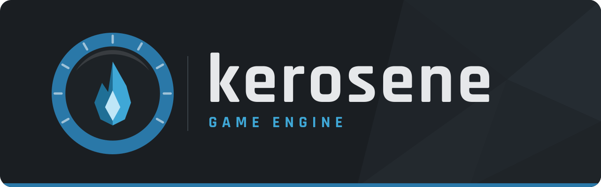

# Welcome!

Hello there! Thank you for checking out Kerosene.

> [!NOTE]
> AI Generated content disclosure: Most of these docs were made by AI. If you want to improve them, please do! All help to kerosene is greatly appreciated :>

> [!WARNING]
> These docs have not fully been built yet, and kerosene remains in pre-alpha and is NOT game ready!

Hello! Welcome to the Kerosene game engine docummentation.

Have you ever used the source engine? Have you wished it was open source and you could make a game with the same tools? With Kerosene, we've tried our best! 

Kerosene is a source-like game engine that is PURELY open source. Thanks to the LGPL 3.0 and MPL 2.0 licenses. 

Kerosene currently supports the following features:

> [!TIP]
> This list is incomplete, please read the rest of the docs to get a full view of this engine's capabilites.

- Box3D based physics
- Brush-based world geometry
- Lighting
- Sound (ALSA only as of pre-alpha 3)
- Hard-coded interaction keys (MB1 = Throw, E = Pick up/drop)
- Entites
- And more!

Want to build a game on it rather than work on the engine? Start with the
[Game developer docs](gamedev/making-a-game.md), and read
[Publishing](gamedev/publishing.md) before you hand anything to anyone.
