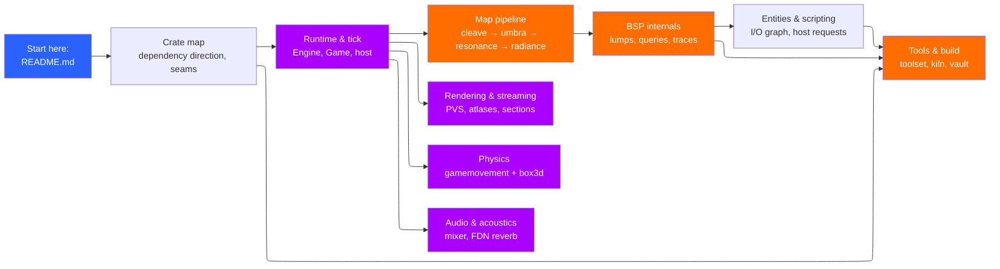

# Architecture notes

This is the developer-facing companion to [`architecture.md`](../docs/architecture.md).
That page is the tour: how a map gets from a `.keromap` to the screen. These
notes are the machinery underneath it — the data structures, the call order,
the invariants, and the places where the code makes a choice that the tour
only gestures at.

They are written to be read next to the source. Every section names the file
it is describing, and the diagrams are the shape of the code rather than an
idealised version of it. When a note and the code disagree, the code wins;
fix the note.

## How to read these notes

The ten pages split along the same lines the crates do, which is not an
accident: the layering is the architecture, and a page per layer is the
cheapest way to keep this document honest.

| Note | What it covers | Primary sources |
|---|---|---|
| [Crate map](crate-map.md) | Who depends on whom, and the four seams | `Cargo.toml`, `crates/kerosene/src/lib.rs` |
| [Runtime and the tick](runtime-tick.md) | `Engine`, `Game`, `host`, the 64 Hz loop | `crates/kerosene-engine/src/{engine,game,host}.rs` |
| [The map pipeline](map-pipeline.md) | Cleave, Umbra, Resonance, Radiance | `tools/{cleave,umbra,resonance,radiance}/src/` |
| [BSP internals and traces](bsp-and-traces.md) | The lump format, tree queries, brush traces | `crates/kerosene-bsp/src/` |
| [Entities and scripting](entities-and-scripting.md) | `EntityWorld`, the event queue, Rhai | `crates/kerosene-entity/src/`, `crates/kerosene-script/src/` |
| [Rendering and streaming](rendering.md) | Mesh build, lightmap atlas, wgpu, PVS | `crates/kerosene-render/src/` |
| [Physics](physics.md) | Source movement and rigid props | `crates/kerosene-physics/src/`, `crates/kerosene-rigid/src/` |
| [Audio and acoustics](audio.md) | Mixer, reverb, Resonance data path | `crates/kerosene-audio/src/` |
| [Tools and the build](tools-and-build.md) | The unified toolset, Kiln, Vault | `tools/kerosene-tools/src/`, `tools/kiln/src/` |
| [Testing](testing.md) | What is tested without a GPU, and why | every crate's `tests` modules |

## The three rules the whole tree keeps

1. **Nothing points upward.** `kerosene-math` knows nothing. The engine knows
   everything except the game. The tools sit off to the side. If a dependency
   would point up, the thing being depended on is in the wrong crate. See
   [Crate map](crate-map.md).

2. **Everything expensive happens once, at build time.** Visibility, lighting
   and acoustics are minutes on a developer's machine and microseconds at
   runtime. That division is why the tools are not part of the engine, and it
   is worth more than any feature. See [The map pipeline](map-pipeline.md).

3. **The engine owns no game.** `kerosene-engine` defines a `Game` trait and
   runs whatever implements it. The stock game lives in `kerosene-game` and the
   engine's own tests depend on it only as a dev-dependency. A game shipped to
   a player is the runtime plus an archive, with no tool in it. See
   [Runtime and the tick](runtime-tick.md).

## Conventions used here

- File paths are repository-relative (`crates/kerosene-engine/src/engine.rs`).
- A `Type::method` reference means that method exists; the surrounding prose
  says what invariant it maintains.
- Diagrams use Mermaid with `layout: elk` (see `book.toml`). Rectangles are
  data or code, rounded shapes are processes, and colours group a subsystem.
- `` `sv_*` `` and `` `r_*` `` names are console variables, registered in
  `register_cvars`/`register_commands` in `crates/kerosene-engine/src/engine.rs`.
