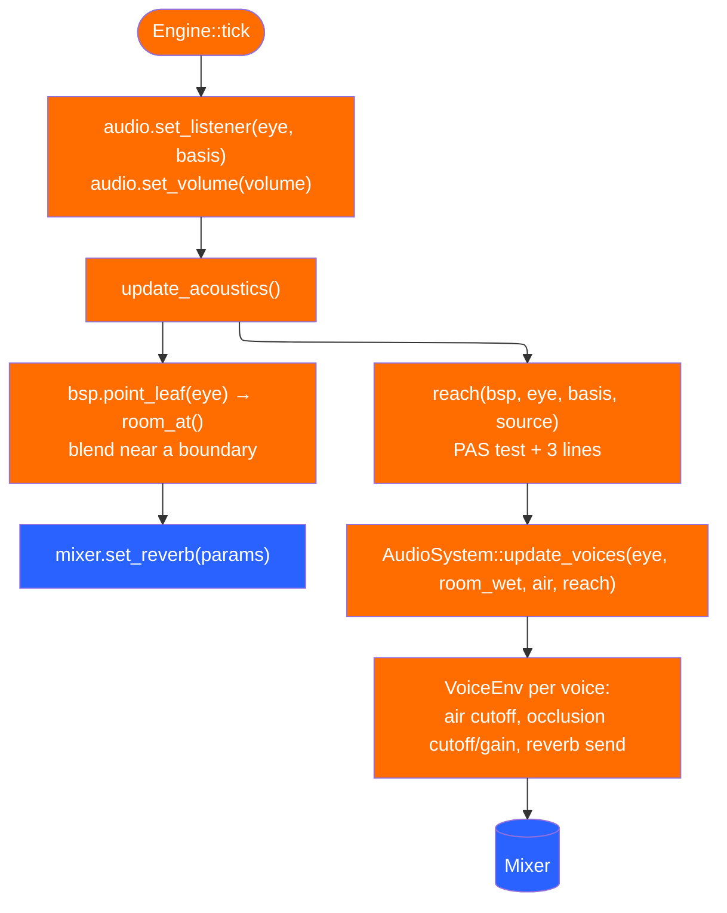

# Audio and acoustics

Sound splits into six separable layers in `kerosene-audio`, and a seventh
(`kerosene-engine/src/audio.rs`) that decides *when*. The split is the design:
everything that decides how a sound sounds — falloff, panning, resampling,
voice limits — is arithmetic on buffers with no hardware in it, so a sound that
pans the wrong way is a numeric fact rather than something you notice by ear on
the third playthrough.

| Layer | Source | Responsibility |
|---|---|---|
| `wav` | `wav.rs` | Source `.wav` → samples |
| `compiled` + `adpcm` | `compiled.rs`, `adpcm.rs` | `.keroaud` → samples (4 bits/sample) |
| `mixer` | `mixer.rs` | Voices → stereo buffer, no device |
| `reverb`, `env`, `dsp` | `reverb.rs`, `env.rs`, `dsp.rs` | The room and the air |
| `device` | `device.rs` (feature `device`) | Buffer → sound card |
| `engine` | `crates/kerosene-engine/src/audio.rs` | Bank, listener, voice tracking |
| `acoustics` | `crates/kerosene-engine/src/acoustics.rs` | Room lookup, occlusion |

The mixer runs **whether or not a sound card does**. If audio only existed when
a device opened, everything about a game's behaviour that touches sound — how
many voices a trigger starts, whether a looping ambience got stopped — would
differ between a machine with sound and one without, and only one of those
would ever be tested. A missing device costs the last hop to the speakers and
nothing else (`AudioSystem::silent`).

## From a name to samples

`kerosene-audio::SoundBank` turns `"door/open"` into samples through a sound
script (`*.kerosnd`, parsed by `script.rs`). `AudioSystem::sound` tries every
form the name might be, not one guessed path — guessing was what reported
`sound/ambient/track.wav` missing when the file on disk was a `.flac`, a path
nobody had written about a file that was right there. The engine prefers
`.keroaud` and falls back to `.wav`, so a designer who just dropped a file in
hears it without running a build, and a shipped game carries only the small
one. A missing name is warned about once (`mark_missing`), because a trigger
firing every tick would otherwise fill the console.

## The mixer

`crates/kerosene-audio/src/mixer.rs` is pure arithmetic. The model is Source's,
because it is the one designers already reason about: a sound is placed in the
world, gets quieter with distance according to its own attenuation, and is
panned by where it is relative to the way you are facing. Sounds with no
position are heard flat.

`SoundParams` carries position, volume, pitch, attenuation, `reference_distance`
and `max_distance`. `Listener { position, basis }` is set each tick by the
engine (`Engine::tick` → `audio.set_listener`), so a headless run mixes the
same audio a windowed one does.

## Reverb: a feedback delay network

`crates/kerosene-audio/src/reverb.rs`. A real room is a sound bouncing between
its walls, losing a little at each one and more of the highs than the lows. The
model is exactly that with eight paths: eight delay lines, a matrix scattering
each output into all the others, and a filter in each loop that removes per band
what the walls would. Every knob is a physical quantity, so the compiler can
fill it in from geometry and a designer can read it.

`ReverbParams` is the description; `Fdn` is the thing that runs. `BANDS_HZ` is
`[125, 500, 2000, 8000]` — four bands, two octaves apart; materials are
tabulated this way, air is modelled this way, and the loop filter can hold
exactly this many independent gains. The network is one per mixer and *slides*
between rooms rather than jumping, because a jump is a click.

## The engine's side

### Room lookup (`crates/kerosene-engine/src/acoustics.rs`)

`surroundings(bsp, eye)` is a leaf lookup and a copy, plus one refinement: near
a boundary between two rooms the two are blended by how close the boundary is
(`BLEND_DISTANCE = 64`), so stepping through a doorway is a *slide* rather than
a switch. The mixer smooths on top of that, but its smoothing is in time and
this is in space — standing still in a doorway should sound like a doorway.
Decay times blend geometrically (`blend`), the way the ear hears them. A forced
`snd_reverb_preset` wins over the map so a designer can audition a hall without
compiling one; a map with no acoustics is dry.

### Occlusion (`reach`)

`reach(bsp, eye, basis, source) -> Reach { Clear | Occluded(f32) | Unreachable }`
asks three questions, cheapest first:

1. Is the source's cluster in the listener's **PAS** — the PVS grown by one
   room? If not, no path exists and the sound is not heard. This is the one
   runtime use of the PAS; streaming uses it too, but for loading.
2. If the source is inside rock, `Unreachable` (but an ear inside rock still
   hears everything rather than nothing).
3. Otherwise, trace three rays from the ear to the source — straight, and to
   each side (`basis.right * 40`). A wall blocks all three; a doorway lets one
   or two through, so the sound comes round it *thinned* rather than cut.

Being in the same room halves the result: a pillar between two people in a hall
is not a wall.

### Voices

`AudioSystem` tracks every positioned voice (`TrackedVoice`) and shapes it each
tick in `update_voices`. Occlusion traces are the expensive part, so at most
`OCCLUSION_BUDGET = 24` voices are re-traced per tick round-robin; the rest
keep last tick's answer, because walls do not move much in 1/64 s. The result
is one `VoiceEnv` per voice (low-pass cutoff, gain, reverb send), pushed to the
mixer through a shared `MixerControl` without taking the mixer's lock for the
listener. The buffers trade places with the mixer's rather than being rebuilt,
so steady state allocates nothing.

`SF_EVERYWHERE = 2` is a spawnflag on a sound entity: heard flat, wherever the
listener is. It is an *engine* convention, not game code, so any game's sound
class gets it by following the field name; the stock `ambient_generic` does.
There is a test in `crates/kerosene/src/lib.rs` asserting the engine's and the
game's constants agree.

### Debug

`snd_acoustics_debug 2` draws every leaf near the eye boxed in its room's colour
(blue dead, red live) and a line from the eye to every followed voice, green
where it gets through and red where it does not
(`crates/kerosene-engine/src/acoustics.rs::debug_lines`). `AudioSystem::room`
holds the last room for the readout.

> Next: [Tools and the build](tools-and-build.md).
