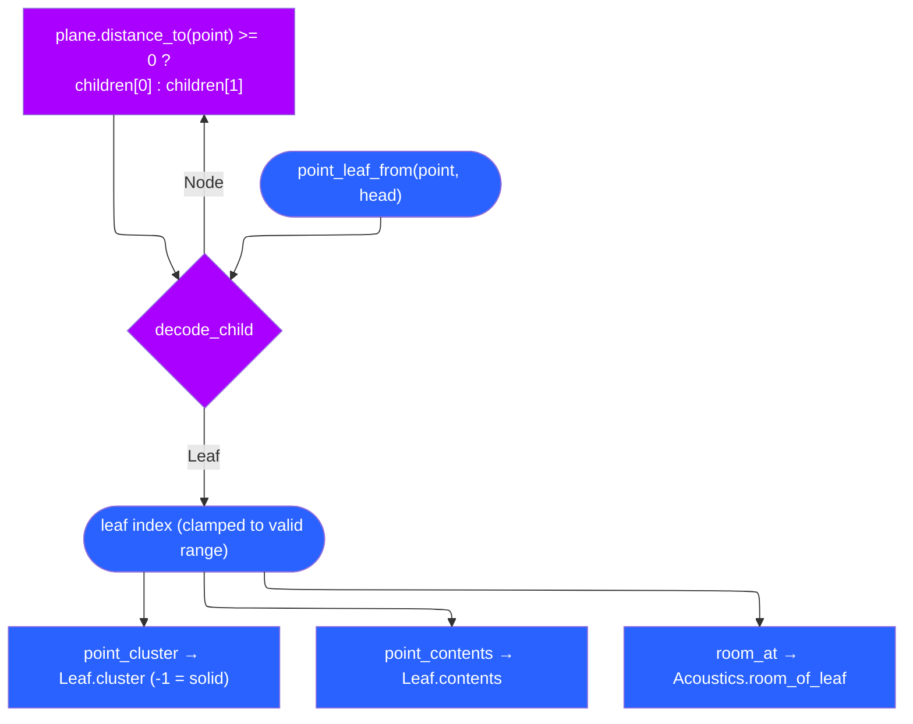
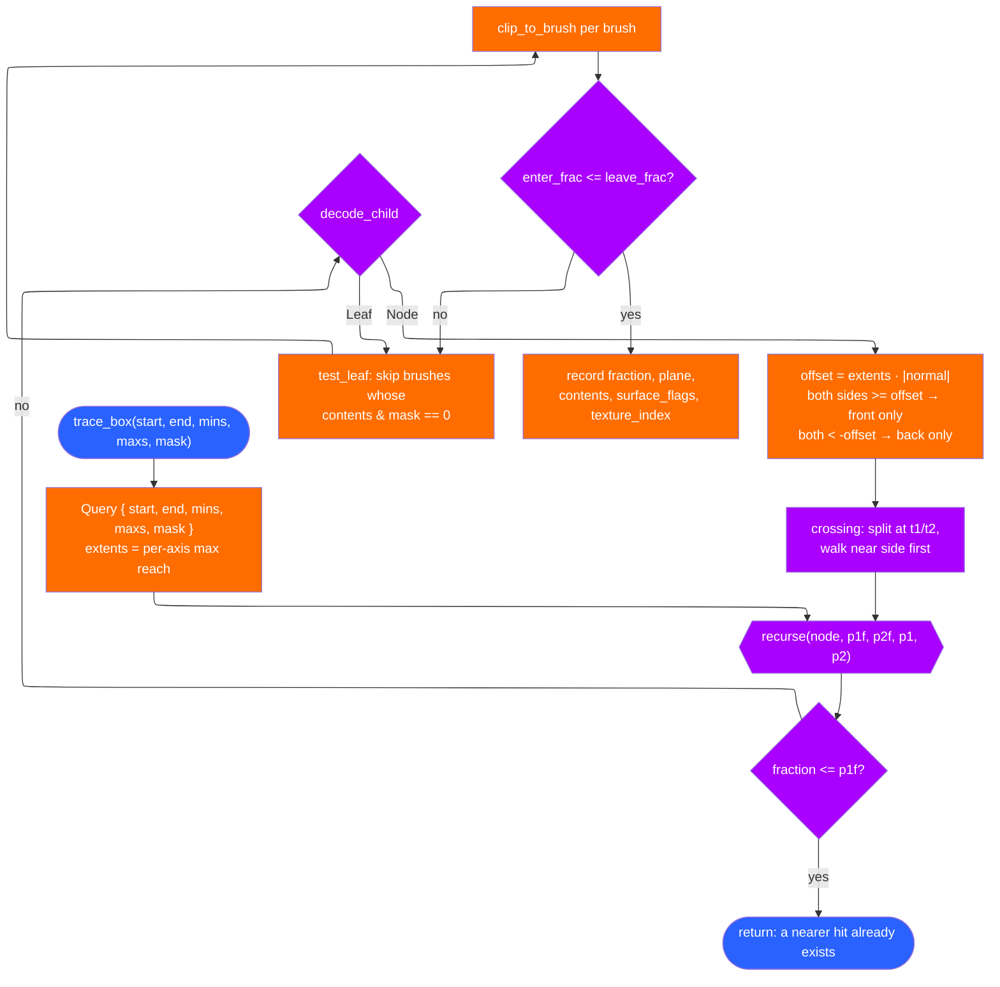

# BSP internals and traces

`kerosene-bsp` is the format the engine runs. It has no GPU dependency and no
compiler dependency: it reads and writes `.kerobsp`, answers tree queries, and
traces. This page is the file layout, the queries built on it, and the trace
algorithm that everything collision-shaped funnels through.

## The file

`crates/kerosene-bsp/src/io.rs` writes a header, a lump directory, then the
lumps. `MAGIC = "KROS"`, `VERSION = 2`, `LUMP_COUNT = 24`. Each `LumpDir`
entry is `offset: u32, length: u32, version: u32, ident: [u8; 4]`. A lump
carries its own version so a bump to one does not invalidate the rest.

Because every lump is an array of `#[repr(C)]`, padding-free `bytemuck::Pod`
records (`crates/kerosene-bsp/src/types.rs`), loading is a bounds check and a
cast rather than a parse. The `size_and_alignment` test enforces padding-free
layout, because a silently inserted pad byte would shift every subsequent
record and corrupt the map in ways that look like geometry bugs.

| # | Lump | Contents |
|---|---|---|
| 0 | `entities` | KeyValues text, one `entity` block each |
| 1 | `planes` | `BspPlane { normal, dist, kind }` |
| 2 | `vertices` | `[f32; 3]` |
| 3 | `edges` | `Edge { v: [u32; 2] }` |
| 4 | `surfedges` | signed indices into `edges`; negative = backwards |
| 5 | `faces` | `Face` (plane, side, surfedge range, texinfo) |
| 6 | `nodes` | `Node` (plane, two children, bounds) |
| 7 | `leaves` | `Leaf` (contents, cluster, leafbrush range) |
| 8–9 | `leaffaces`, `leafbrushes` | indirection from leaf to faces/brushes |
| 10 | `models` | `Model`, one per brush entity plus world (0) |
| 11–12 | `brushes`, `brushsides` | convex brushes and their planes |
| 13–15 | `texinfo`, `texdata`, `texdata_strings` | material binding |
| 16 | `visibility` | RLE PVS/PAS |
| 17 | `lighting` | `ColorRgbExp32` per luxel |
| 18–19 | `acoustics`, `acoustic_leafs` | rooms and leaf→room |
| 20–22 | `sections`, `face_sections`, `brush_sections` | streaming |
| 23 | `cubemaps` | reflection probes (`KCUB`), empty without `env_cubemap`s |

The indirection in lumps 3–4 is the important one. Vertices are reached as
`surfedges[first_surfedge .. + num_surfedges]`, each a *signed* edge index,
negative meaning "walk the edge backwards". Two faces meeting at an edge share
one edge record and one pair of vertex positions, which keeps their seam
watertight no matter how the float arithmetic rounds. `Bsp::face_vertices`
walks exactly this.

## The tree

An interior `Node` has a plane and two children; a leaf is encoded as a
negative child index. `decode_child`/`encode_leaf` in `types.rs` do the
encoding, and `Child::{Node, Leaf}` is the decoded form.

`Bsp::point_leaf_from` is bounded by `nodes.len() + 1` rather than `loop`, so a
cyclic tree from a broken compile returns a wrong answer instead of hanging
the engine. Every position update, sound and visibility test starts here, and
it is tree-depth dot products, not geometry count — the whole reason the BSP
exists.

## Visibility queries

`crates/kerosene-bsp/src/vis.rs` is the reader. Rows are bit-vectors, one bit
per cluster, run-length encoded on zero bytes — nearly free to decode and
enormously effective because a typical row is mostly zeroes.

- `VisData::decompress(cluster, VisKind::Pvs)` gives the row.
- `Bsp::visible_leaves(from_cluster)` turns it into leaf indices.
- `Bsp::cluster_audible` uses `VisKind::Pas` — the PVS flooded one extra step,
  the *Potentially Audible Set*. Sound goes around a corner where sight does
  not, and streaming uses the PAS as a one-doorway warning margin.
- With no `VisData`, both return everything. An un-vised map still renders, it
  just loses culling.

## Traces

`crates/kerosene-bsp/src/trace.rs` implements tracing against **brushes**, not
triangles. A brush is a handful of planes, so testing one is a handful of dot
products regardless of how detailed its surface is, and the BSP narrows the
search to the brushes along the path.

The box trace uses the standard trick: push each brush plane outward by the
box's extent along that plane's normal
(`offset = extents·|normal|`), which turns a swept-box test back into a
swept-point test against a fattened brush. Walking the near side first lets an
early hit prune the far side.

`clip_to_brush` tracks where the path enters the brush (latest front-to-back
crossing) and where it leaves (earliest back-to-front). If it enters before it
leaves, it is inside and the entry point is the hit. One subtlety is recorded
in the code comment: the early-out tests `fraction == 0.0`, *not* `all_solid`,
because `all_solid` starts true and is only cleared by visiting open space —
testing it returned after the first brush of every solid leaf, and a
`func_door` built from two brushes only ever collided with one of them.

### Contents and surface flags

`crates/kerosene-bsp/src/types.rs` defines `contents` and `surf`. They are
flags, not enums, because one brush can be several things at once: water that
also blocks bullets, a grate that blocks players but not sight. Masks are named
for the question being asked:

| Mask | Includes | Used by |
|---|---|---|
| `MASK_PLAYER_SOLID` | SOLID, MOVEABLE, PLAYER_CLIP, WINDOW, GRATE | player movement |
| `MASK_SHOT` | SOLID, MOVEABLE, WINDOW, GRATE | bullets, pick-up reach |
| `MASK_OPAQUE` | SOLID, MOVEABLE, OPAQUE | line of sight, shadow rays |
| `MASK_WATER` | WATER, SLIME | water level |
| `MASK_VOLUMES` | WATER, SLIME, LADDER | non-solid point queries |

`DETAIL = 1 << 27` marks brushes kept out of the tree entirely — a railing or
pillar would otherwise carve the world into slivers and inflate vis for no
benefit, since you cannot hide behind a railing. Detail geometry renders and
collides but does not split space.

### Brush entities are separate models

A door, lift or rotating brush is compiled as its own `Model` with its own
leaves, and its leaves are **not** in the world's PVS. It is traced separately
(`Bsp::trace_model`) and the nearest hit taken. This is why the renderer draws
brush entities in a second pass: a leaf walk finds the world and nothing else.
Forgetting that is how you walk through every door in the game, and — per the
`architecture.md` war story — how every brush entity was once built into the
mesh and never drawn.

### Point contents

`Bsp::point_contents_brushes` asks what is at a point directly, which is how
non-solid volumes are found: water, slime and ladders never appear in a
movement trace, so they need a query of their own rather than riding along with
`MASK_PLAYER_SOLID`.

## Acoustics and sections

Two lumps carry compiler output the engine reads whole:

- `crates/kerosene-bsp/src/acoustics.rs` — `AcousticRoom` per room behind an
  `AcousticHeader`, plus one `u16` per leaf (`NO_ROOM` for solid). A room's
  record is everything the mixer's reverb needs in the units the reverb takes,
  and it keeps what it was derived from (absorption per band, mean free path)
  so a designer can ask why a corridor rings.
- `crates/kerosene-bsp/src/sections.rs` — `SectionRecord` per section, one
  `u16` per face and per brush. A map with no streamed visgroups still writes
  one section holding everything, and a file missing the lumps reads the same
  way, so nothing special-cases an older map.

> Next: [Entities and scripting](entities-and-scripting.md).
