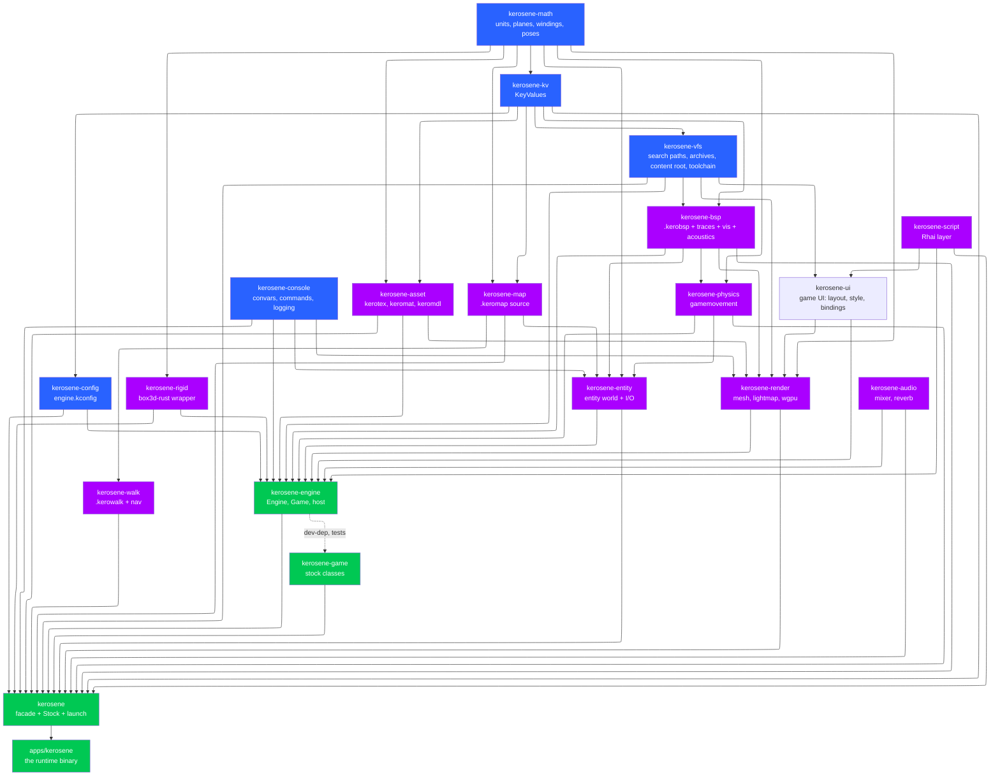
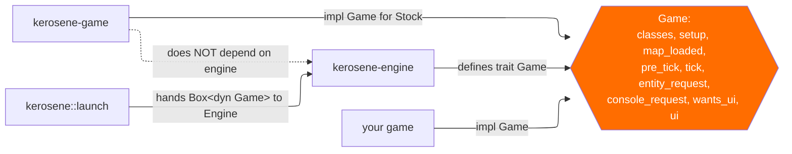
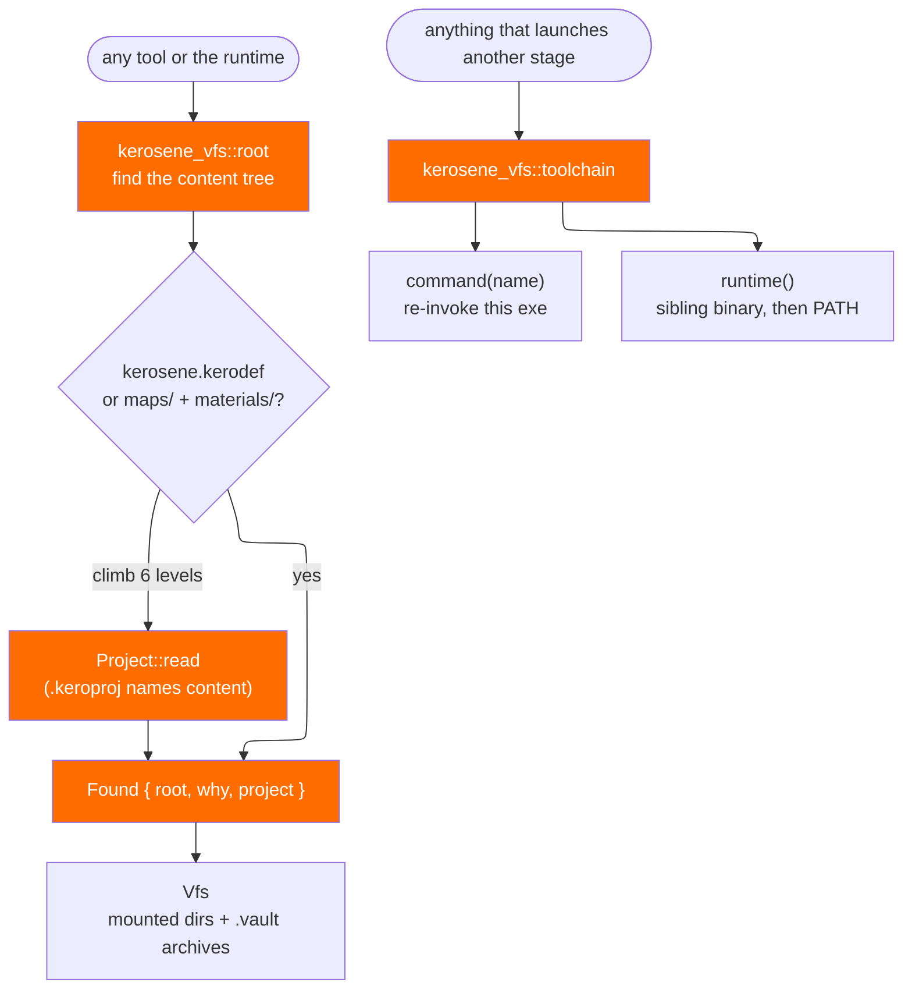

# Crate map

The workspace is 18 engine crates, 10 tool crates, a facade crate and one
application. `Cargo.toml` at the root lists them; the interesting part is the
direction of the arrows.

## The dependency graph

Read it top to bottom: nothing points back up. `kerosene-math` has two
dependencies, both third-party (`glam` and `bytemuck`). `kerosene-engine`
depends on almost everything and is depended on by nothing except the facade
and the runtime. The tools are not in this graph at all, and that is the point
— see [Tools and the build](tools-and-build.md).

The graph is not exactly `Cargo.toml`: `kerosene-engine` does not depend on
`kerosene-game`. The stock game depends on the *entity* and *physics* and
*map* crates, and the engine has it only as a dev-dependency for tests.
`kerosene::game::Stock` is the type that joins the two at the facade level.

## The four seams worth naming

### 1. The game seam

`crates/kerosene-engine/src/game.rs` defines the trait. Every hook takes
`&mut Engine`, which is what lets a game do anything the engine can. The price
is stated in that file: the engine holds the game *outside itself* while a hook
runs (`Engine::with_game_mut`), so a hook cannot cause another hook on the same
game. `tick` must use `Engine::request_map` rather than `Engine::load_map` for
that reason. A nested call is logged and skipped rather than deadlocking.

Handlers on entity classes are narrower still: they get `&mut EntityWorld` and
nothing else, and leave a `HostRequest` when they need the rest of the engine.
That keeps `kerosene-entity` a plain data structure, testable without an
`Engine`. See [Entities and scripting](entities-and-scripting.md).

### 2. The platform seam

`Engine` in `crates/kerosene-engine/src/engine.rs` does not know what a window
is. `crates/kerosene-engine/src/host.rs` adds winit, wgpu and egui on top. A
dedicated server is `Engine` alone; `--headless` in `launch.rs` is exactly
that. The rule is enforced by `Engine` simply having no surface field.

### 3. The content seam

`crates/kerosene-vfs/src/root.rs` exists because every tool used to infer the
content directory independently and they disagreed; a tool looking in the wrong
directory is indistinguishable from a broken tool. `Found` carries the `why`
string so a wrong guess explains itself. `crates/kerosene-vfs/src/toolchain.rs`
does the same for the two other binaries — a subcommand is always present
because it is the executable re-invoking itself, and the runtime is a sibling
first and on `PATH` second.

### 4. The format seam

Tools write formats; the engine reads them. `kerosene-asset`, `kerosene-map`
and `kerosene-bsp` are shared by both sides, so the writer and reader are
compiled from the same struct definitions. This is why `kerosene-bsp` has no
GPU dependency and `kerosene-render` has no compile code: the format is the
agreement, and both sides meet in a crate that knows only the format.

## The facade

`crates/kerosene/src/lib.rs` is deliberately thin. It re-exports every engine
crate as a module (`kerosene::bsp`, `kerosene::physics`, …) and the third-party
crates a game names in its own signatures (`glam`, `egui`, `rhai`, `winit`) so
a game cannot end up linking two versions of `glam`. It also provides:

- `pub mod game` with `Stock`, the stock classes plus the `Game` impl;
- `pub mod tools` behind the `tools` feature, for a game that ships an editor;
- `pub mod prelude`, the handful of names most game code names.

The runtime binary `apps/kerosene/src/main.rs` is a call to
`kerosene::launch(kerosene::game::Stock, LaunchOptions { .. })`. Nothing else.

## Crate summaries

| Crate | Responsibility | Notable source |
|---|---|---|
| `kerosene-math` | Units, `Plane`/`Winding`/`Aabb`, angles, `Pose`, epsilon constants | `src/units.rs`, `src/plane.rs`, `src/winding.rs` |
| `kerosene-kv` | KeyValues parse/serialise, typed reads, `format_float` | `src/parse.rs`, `src/value.rs` |
| `kerosene-console` | ConVars, ConCommands, command buffer, log relay, crash handler | `src/lib.rs`, `src/logging.rs` |
| `kerosene-config` | `engine.kconfig` with defaults for every key | `src/lib.rs`, `src/renderer.rs` |
| `kerosene-vfs` | Search-path stack, `.vault` archives, content discovery, toolchain | `src/lib.rs`, `src/root.rs`, `src/archive.rs` |
| `kerosene-asset` | `.kerotex`, `.keromat`, `.keromdl` readers/writers | `src/texture.rs`, `src/material.rs`, `src/model.rs` |
| `kerosene-map` | `.keromap` source, brush ops (clip/carve/hollow), editor metadata | `src/solid.rs`, `src/ops.rs`, `src/editor.rs` |
| `kerosene-bsp` | `.kerobsp` lumps, tree queries, traces, PVS, acoustics, sections | `src/lib.rs`, `src/trace.rs`, `src/vis.rs` |
| `kerosene-walk` | `.kerowalk` walkmap and navigation graph | `src/lib.rs`, `src/nav.rs` |
| `kerosene-physics` | Source `gamemovement`, `CollisionWorld` trait | `src/movement.rs`, `src/world.rs` |
| `kerosene-rigid` | box3d-rust wrapper, inches native | `src/lib.rs` |
| `kerosene-entity` | Entity slots, fields, I/O queue, class registry, schema | `src/world.rs`, `src/io.rs`, `src/schema.rs` |
| `kerosene-render` | CPU PVS/mesh build, lightmap atlas, dynamic lights, probes, wgpu backend | `src/mesh.rs`, `src/gpu.rs`, `src/lightmap.rs` |
| `kerosene-anim` | skeleton, clip sampling, crossfade, skinning palette | `src/lib.rs` |
| `kerosene-audio` | ADPCM, mixer, FDN reverb, device output | `src/mixer.rs`, `src/reverb.rs`, `src/compiled.rs` |
| `kerosene-script` | Rhai VM, world snapshot, `ScriptAction` queue | `src/lib.rs`, `src/view.rs`, `src/bindings.rs` |
| `kerosene-ui` | Game UI: XML/CSS/Rhai documents, store and bindings, flexbox, glyph atlas, display list | `src/document.rs`, `src/bind.rs`, `src/style.rs` |
| `kerosene-toolui` | The tools' egui window host, theme and widgets | `src/lib.rs`, `src/theme.rs` |
| `kerosene-engine` | `Engine`, `Game`, `host`, `launch`, streaming, acoustics glue | `src/engine.rs`, `src/host.rs` |
| `kerosene-game` | Stock classes: doors, triggers, logic, props, sound | `src/doors.rs`, `src/logic.rs`, `src/props.rs` |
| `kerosene` | Facade, `Stock`, `launch`, prelude | `src/lib.rs` |

> Next: [Runtime and the tick](runtime-tick.md).
