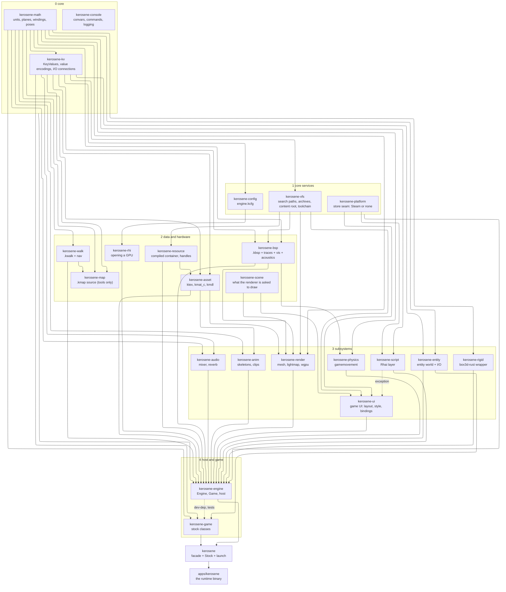
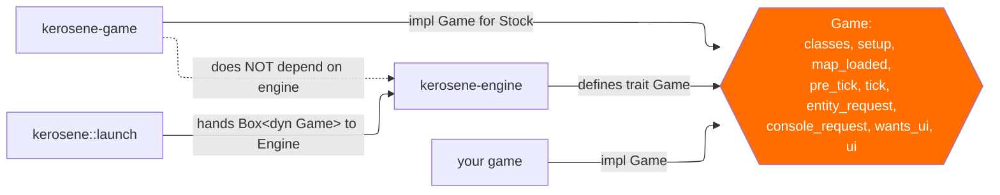
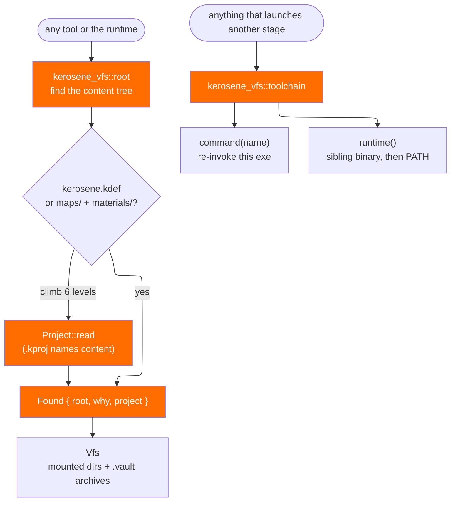

# Crate map

The workspace is 23 engine crates, 11 tool crates, the toolset that joins
them, the `kerosene` game crate, one application and `xtask`: 39 packages,
all one version. `Cargo.toml` at the root lists them; the interesting part
is the direction of the arrows.

## The dependency graph

The crates sit in layers, and a crate depends only on the layers below it.
`cargo xtask layers` checks that on every CI run, from the table in
`xtask/src/layers.rs`; the reasoning is the refactor design document's, in
`src/refactor/`.

| Layer | Crates | May depend on |
|---|---|---|
| 0 core | math, kv, console | each other |
| 1 core services | config, vfs, platform | layer 0; each other |
| 2 data and hardware | resource, asset, bsp, walk, map, scene, rhi | layers 0–1; each other |
| 3 subsystems | render, physics, rigid, anim, audio, entity, script, ui | layers 0–2, **not each other** |
| 4 host and game | engine, game | layers 0–3 |
| 5 tools | toolui and every tool | layers 0–4; each other |
| 6 facade | `kerosene` | everything |

Two extra rules. `kerosene-map`, the `.kmap` source format, is for the tools
only: nothing below layer 5 may link it, because the runtime loads compiled
maps. And the one subsystem edge that is allowed anyway, `ui` → `script`, is
listed in `xtask/src/layers.rs` with its reason, as an exception to revisit.

```mermaid
---
config:
  layout: elk
---
flowchart TB
    subgraph L0["0 core"]
        math["kerosene-math<br/>units, planes, windings, poses"]
        kv["kerosene-kv<br/>KeyValues, value encodings, I/O connections"]
        console["kerosene-console<br/>convars, commands, logging"]
    end
    subgraph L1["1 core services"]
        config["kerosene-config<br/>engine.kcfg"]
        vfs["kerosene-vfs<br/>search paths, archives, content root, toolchain"]
        platform["kerosene-platform<br/>store seam: Steam or none"]
    end
    subgraph L2["2 data and hardware"]
        resource["kerosene-resource<br/>compiled container, handles"]
        asset["kerosene-asset<br/>ktex, kmat_c, kmdl"]
        bsp["kerosene-bsp<br/>.kbsp + traces + vis + acoustics"]
        walk["kerosene-walk<br/>.kwalk + nav"]
        map["kerosene-map<br/>.kmap source (tools only)"]
        scene["kerosene-scene<br/>what the renderer is asked to draw"]
        rhi["kerosene-rhi<br/>opening a GPU"]
    end
    subgraph L3["3 subsystems"]
        render["kerosene-render<br/>mesh, lightmap, wgpu"]
        physics["kerosene-physics<br/>gamemovement"]
        rigid["kerosene-rigid<br/>box3d-rust wrapper"]
        anim["kerosene-anim<br/>skeletons, clips"]
        audio["kerosene-audio<br/>mixer, reverb"]
        entity["kerosene-entity<br/>entity world + I/O"]
        script["kerosene-script<br/>Rhai layer"]
        ui["kerosene-ui<br/>game UI: layout, style, bindings"]
    end
    subgraph L4["4 host and game"]
        engine["kerosene-engine<br/>Engine, Game, host"]
        game["kerosene-game<br/>stock classes"]
    end
    facade["kerosene<br/>facade + Stock + launch"]
    runtime["apps/kerosene<br/>the runtime binary"]

    math --> kv
    kv --> config
    kv --> vfs
    vfs --> resource
    math --> asset
    kv --> asset
    resource --> asset
    math --> bsp
    kv --> bsp
    vfs --> bsp
    math --> walk
    math --> map
    kv --> map
    walk --> map
    config --> rhi
    math --> anim
    asset --> anim
    math --> audio
    kv --> audio
    math --> physics
    bsp --> physics
    math --> rigid
    math --> entity
    kv --> entity
    math --> render
    asset --> render
    bsp --> render
    vfs --> render
    scene --> render
    math --> script
    platform --> script
    script -. "exception" .-> ui
    platform --> ui
    scene --> ui
    vfs --> ui
    math --> game
    kv --> game
    entity --> game
    L0 --> engine
    L1 --> engine
    anim --> engine
    asset --> engine
    audio --> engine
    bsp --> engine
    entity --> engine
    physics --> engine
    render --> engine
    resource --> engine
    rhi --> engine
    rigid --> engine
    script --> engine
    ui --> engine
    walk --> engine
    engine -. "dev-dep, tests" .-> game
    engine --> facade
    game --> facade
    facade --> runtime
```

Read it top to bottom: nothing points back up, and nothing inside layer 3
points sideways except the one dashed exception. `kerosene-math` has two
dependencies, both third-party (`glam` and `bytemuck`). `kerosene-engine`
depends on almost everything and is depended on by nothing except the facade
and the runtime. The facade re-exports every engine crate; those edges are
left out. The tools are not in this graph at all, and that is the point
— see [Tools and the build](tools-and-build.md).

The graph is not exactly `Cargo.toml`: `kerosene-engine` does not depend on
`kerosene-game`. The stock game depends on the *entity* and *kv* crates,
and the engine has it only as a dev-dependency for tests.
`kerosene::game::Stock` is the type that joins the two at the facade level.

## The four seams worth naming

### 1. The game seam

```mermaid
---
config:
  layout: elk
---
flowchart LR
    engine["kerosene-engine"] -- "defines trait Game" --> trait{{"Game:<br/>classes, setup, map_loaded,<br/>pre_tick, tick, entity_request,<br/>console_request, wants_ui, ui"}}
    game["kerosene-game"] -- "impl Game for Stock" --> trait
    your["your game"] -- "impl Game" --> trait
    facade["kerosene::launch"] -- "hands Box&lt;dyn Game&gt; to Engine" --> engine
    game -. "does NOT depend on engine" .-> engine

    classDef seam fill:#FF6D00,color:#fff
    class trait seam
```

`crates/kerosene-engine/src/game.rs` defines the trait. Every hook takes
`&mut Engine`, which is what lets a game do anything the engine can. The price
is stated in that file: the engine holds the game *outside itself* while a hook
runs (`Engine::with_game_mut`), so a hook cannot cause another hook on the same
game. `tick` must use `Engine::request_map` rather than `Engine::load_map` for
that reason. A nested call is logged and skipped rather than deadlocking.

Handlers on entity classes are narrower still: they get `&mut EntityWorld` and
nothing else, and leave a `HostRequest` when they need the rest of the engine.
That keeps `kerosene-entity` a plain data structure, testable without an
`Engine`. See [Entities and scripting](entities-and-scripting.md).

### 2. The platform seam

`Engine` in `crates/kerosene-engine/src/engine.rs` does not know what a window
is. `crates/kerosene-engine/src/host.rs` adds winit, wgpu and egui on top. A
dedicated server is `Engine` alone; `--headless` in `launch.rs` is exactly
that. The rule is enforced by `Engine` simply having no surface field.

### 3. The content seam

```mermaid
---
config:
  layout: elk
---
flowchart TB
    caller(["any tool or the runtime"]) --> root["kerosene_vfs::root<br/>find the content tree"]
    root --> marker{"kerosene.kdef<br/>or maps/ + materials/?"}
    marker -- yes --> found["Found { root, why, project }"]
    marker -- "climb 6 levels" --> project["Project::read<br/>(.kproj names content)"]
    project --> found
    found --> vfs["Vfs<br/>mounted dirs + .vault archives"]

    caller2(["anything that launches another stage"]) --> tc["kerosene_vfs::toolchain"]
    tc --> sub["command(name)<br/>re-invoke this exe"]
    tc --> rt["runtime()<br/>sibling binary, then PATH"]

    classDef seam fill:#FF6D00,color:#fff
    class root,project,tc,found seam
```

`crates/kerosene-vfs/src/root.rs` exists because every tool used to infer the
content directory independently and they disagreed; a tool looking in the wrong
directory is indistinguishable from a broken tool. `Found` carries the `why`
string so a wrong guess explains itself. `crates/kerosene-vfs/src/toolchain.rs`
does the same for the two other binaries — a subcommand is always present
because it is the executable re-invoking itself, and the runtime is a sibling
first and on `PATH` second.

### 4. The format seam

Tools write formats; the engine reads them. `kerosene-asset`, `kerosene-map`
and `kerosene-bsp` are shared by both sides, so the writer and reader are
compiled from the same struct definitions. This is why `kerosene-bsp` has no
GPU dependency and `kerosene-render` has no compile code: the format is the
agreement, and both sides meet in a crate that knows only the format.

## The facade

`crates/kerosene/src/lib.rs` is the game crate, and the API boundary: its
public surface is what Kerosene's version follows (see
[Versioning](../docs/versioning.md)). It is deliberately thin, and draws one
line:

- the stable modules, re-exported whole: `engine`, `entity`, `math`,
  `console`, `physics`, `script`, `ui`, `platform`, `vfs`;
- `kerosene::internals`, everything else — `asset`, `audio`, `bsp`,
  `config`, `kv`, `map`, `render`, `rigid`, `walk` — public but outside the
  promise;
- the third-party crates a game names in its own signatures (`glam`, `egui`,
  `rhai`, `winit`, `serde_json`) so a game cannot end up linking two versions
  of `glam`;
- `pub mod game` with `Stock`, the stock classes plus the `Game` impl;
- `pub mod tools` behind the `tools` feature, for a game that ships an editor;
- `pub mod prelude`, the handful of names most game code names, and
  `VERSION`.

It is `#![warn(missing_docs)]`, and CI builds its docs with warnings denied.

The runtime binary `apps/kerosene/src/main.rs` is
`kerosene::launch(kerosene::game::Stock::default(), LaunchOptions::new(..))`.
Nothing else.

None of the workspace's packages is published by itself (each says
`publish = false`). `cargo xtask bundle` (`xtask/src/bundle.rs`) makes the
one crate that is: it copies each package into `src/__k/<module>/` of a
`kerosene` crate under `target/bundle/`, turns its `lib.rs` into a
`mod.rs`, rewrites `crate::` and every other crate's name into
`crate::__k::<module>::`, gates the tool-only crates on the `tools`
feature, flattens the features, and merges every dependency into one
manifest. The facade's `lib.rs` becomes the bundle's root unchanged but for
those paths, so its public face is the same in both. The tool packages are
named `kerosene-<tool>`, with `[lib] name` keeping the short name; every
internal dependency is pinned at `=<version>` and moved by
`scripts/bump-version.sh`.

## Crate summaries

| Crate | Responsibility | Notable source |
|---|---|---|
| `kerosene-math` | Units, `Plane`/`Winding`/`Aabb`, angles, `Pose`, epsilon constants | `src/units.rs`, `src/plane.rs`, `src/winding.rs` |
| `kerosene-kv` | KeyValues parse/serialise, typed reads, `format_float`, the I/O `Connection` encoding | `src/parse.rs`, `src/value.rs`, `src/connection.rs` |
| `kerosene-console` | ConVars, ConCommands, command buffer, log relay, crash handler | `src/lib.rs`, `src/logging.rs` |
| `kerosene-config` | `engine.kcfg` with defaults for every key | `src/lib.rs`, `src/renderer.rs` |
| `kerosene-vfs` | Search-path stack, `.vault` archives, content discovery, toolchain | `src/lib.rs`, `src/root.rs`, `src/archive.rs` |
| `kerosene-resource` | The compiled resource container (header, typed blocks, references, source hash), `Resource<T>` handles and their cache, the asset-type table | `src/container.rs`, `src/handle.rs`, `src/types.rs` |
| `kerosene-asset` | `.ktex`, `.kmdl` readers/writers; `.kmat` source and its compiled `.kmat_c` | `src/texture.rs`, `src/material.rs`, `src/model.rs` |
| `kerosene-map` | `.kmap` source, brush ops (clip/carve/hollow), editor metadata | `src/solid.rs`, `src/ops.rs`, `src/editor.rs` |
| `kerosene-bsp` | `.kbsp` lumps, tree queries, traces, PVS, acoustics, sections | `src/lib.rs`, `src/trace.rs`, `src/vis.rs` |
| `kerosene-walk` | `.kwalk` walkmap, navigation graph, the per-face `WalkmapRule` | `src/lib.rs`, `src/nav.rs`, `src/rule.rs` |
| `kerosene-scene` | What the renderer is asked to draw: the UI display list, its images, the glyph atlas size | `src/draw.rs`, `src/images.rs` |
| `kerosene-rhi` | The render hardware interface: opening a GPU for the configured renderer | `src/lib.rs`, `src/gpu.rs` |
| `kerosene-physics` | Source `gamemovement`, `CollisionWorld` trait | `src/movement.rs`, `src/world.rs` |
| `kerosene-rigid` | box3d-rust wrapper, inches native | `src/lib.rs` |
| `kerosene-entity` | Entity slots, fields, I/O queue, class registry, schema, save snapshots | `src/world.rs`, `src/io.rs`, `src/schema.rs`, `src/snapshot.rs` |
| `kerosene-render` | CPU PVS/mesh build, lightmap atlas, dynamic lights, probes, wgpu backend | `src/mesh.rs`, `src/gpu.rs`, `src/lightmap.rs` |
| `kerosene-anim` | skeleton, clip sampling, crossfade, skinning palette | `src/lib.rs` |
| `kerosene-audio` | ADPCM, mixer, FDN reverb, device output | `src/mixer.rs`, `src/reverb.rs`, `src/compiled.rs` |
| `kerosene-script` | Rhai VM (and the one `rhai` dependency), world snapshot, `ScriptAction` queue, the `platform` object both script VMs register | `src/lib.rs`, `src/view.rs`, `src/bindings.rs`, `src/platform.rs` |
| `kerosene-ui` | Game UI: XML/CSS/Rhai documents, store and bindings, flexbox, glyph atlas | `src/document.rs`, `src/bind.rs`, `src/style.rs` |
| `kerosene-platform` | The store: `Platform` (validation, batching, events) over a `Backend` -- Steam behind the `steam` feature, an offline stand-in otherwise | `src/lib.rs`, `src/steam.rs` |
| `kerosene-toolui` | The tools' egui window host, theme and widgets | `src/lib.rs`, `src/theme.rs` |
| `kerosene-engine` | `Engine`, `Game`, `host`, `launch`, streaming, acoustics glue, saved games | `src/engine.rs`, `src/host.rs`, `src/save.rs` |
| `kerosene-game` | Stock classes: doors, triggers, logic, props, sound | `src/doors.rs`, `src/logic.rs`, `src/props.rs` |
| `kerosene` | Facade, `Stock`, `launch`, prelude | `src/lib.rs` |

> Next: [Runtime and the tick](runtime-tick.md).
