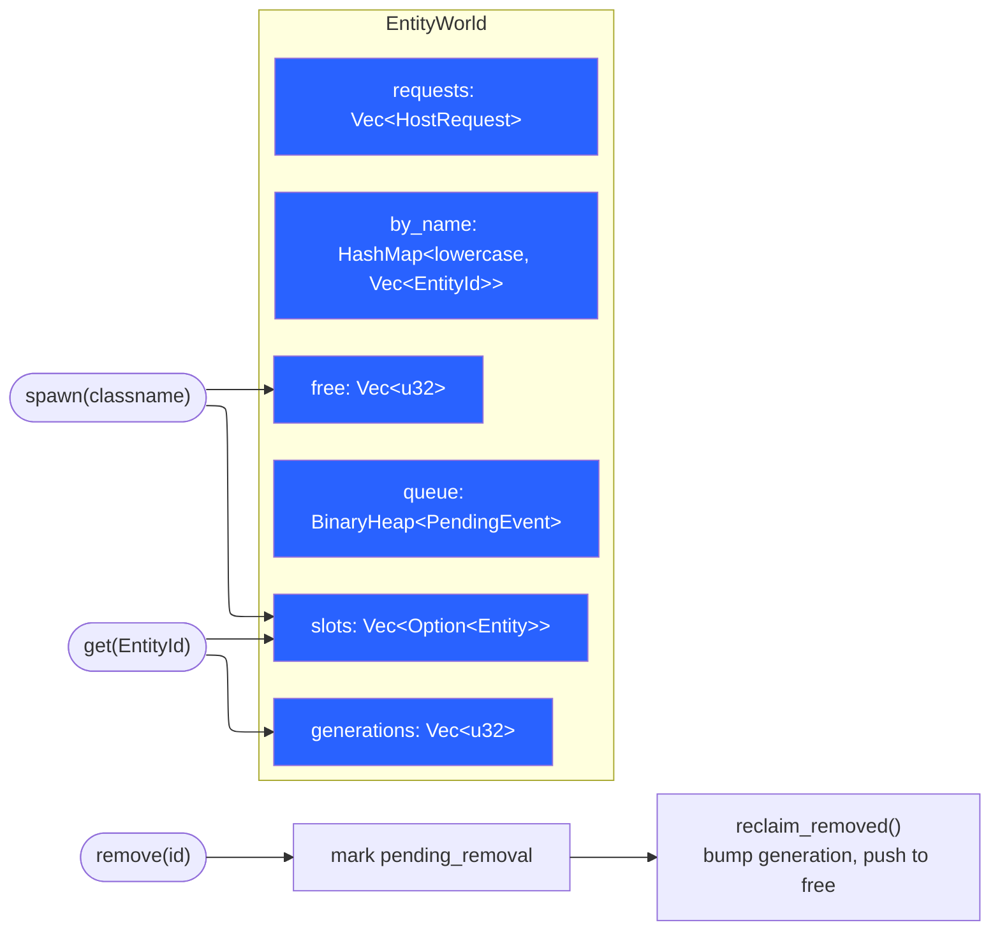
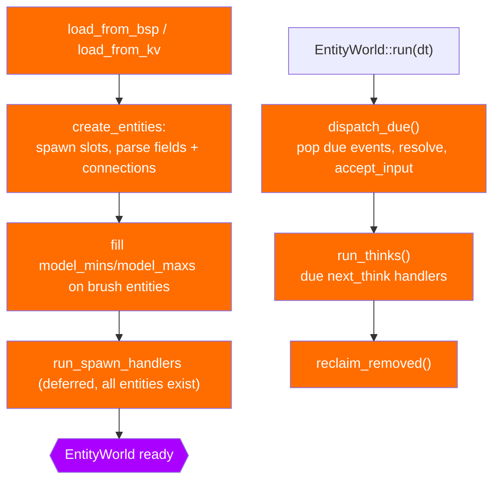
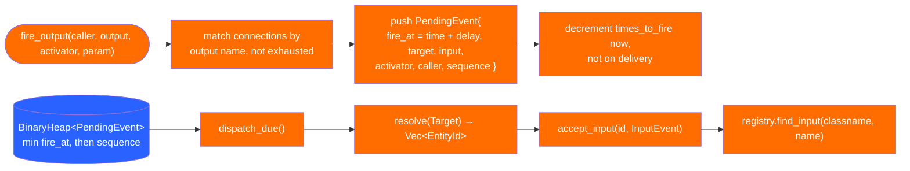
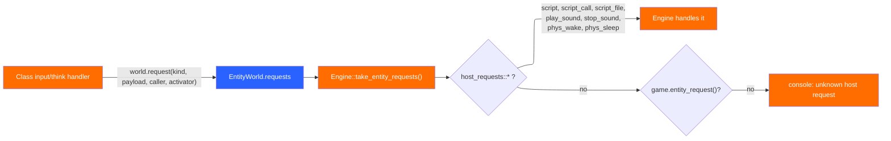
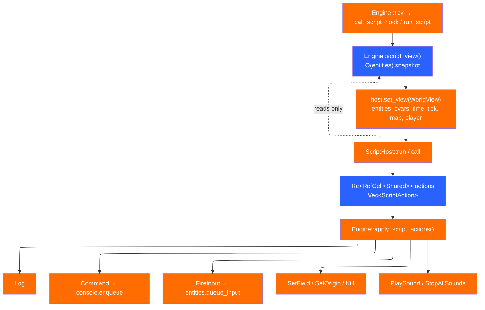

# Entities and scripting

Entities are the half of a level that is not geometry. `kerosene-entity` owns
the data structure and the I/O graph; `kerosene-game` decides what the names
mean. This page is the storage model, the event queue, the class registry, and
the Rhai layer above it.

## The storage model

`crates/kerosene-entity/src/world.rs`:

`EntityId { index, generation }` is a generational handle. The generation is
bumped in `reclaim_removed`, so a handle to a removed entity fails to resolve
rather than silently addressing whoever moved into the slot. Entity references
outlive entities constantly — a queued event naming an entity that dies before
it fires is routine — and without the generation those become use-after-free
bugs with no crash to point at them.

Removal is deferred: `remove()` sets `pending_removal`, and the slot is only
reclaimed at the end of the tick, so handlers mid-dispatch never find it
vanished underneath them.

`Entity` carries `origin`, `angles`, `fields`, `connections`, `next_think`,
`brush_model` and `pending_removal`. `brush_model: Option<usize>` is set from a
`"model" "*N"` key; anything else stays a plain field (a studio model path).

## Fields are a bag, not a struct

`crates/kerosene-entity/src/value.rs` defines `Value` (`Bool`, `Int`, `Float`,
`Text`, `Vector`, `Angle`) and `Fields`, a `HashMap<String, Value>`. The set of
meaningful fields belongs to the *game*, not the engine: a mod adds a field by
writing it in the editor, and nothing in the engine changes. This is Source's
`datadesc` idea with the boilerplate removed. `Value::Display` formats numbers
through `kerosene_math::format_float`, so a float that happens to be whole does
not read as `250.000000`.

## The class registry

`crates/kerosene-entity/src/registry.rs` maps a classname to a `ClassDef`:
optional `spawn`/`think` handlers, a list of `(input_name, handler)`, and a
list of output names. Handlers are plain `fn` pointers taking `&mut EntityWorld
and an id — narrow on purpose, so the entity world stays testable without an
engine.

Spawn handlers are deferred until every entity exists, so one entity can find
another by name during its own spawn (a door finding its button). Brush
entities get their model bounds as `model_mins`/`model_maxs` **before** spawn
handlers run, because a class like `func_door` needs to know how far it travels
and that comes from geometry, not a keyvalue.

The registry declares outputs (`ClassDef.outputs`) even though firing one is
just a string passed to `EntityWorld::fire_output`. Declaring keeps the
editor's schema honest: a test checks the game's outputs against the `.kerodef`
schema, so adding an output and forgetting to offer it in Chisel is a build
failure rather than a wiring session that silently does nothing.

## The event queue

`crates/kerosene-entity/src/io.rs` defines `Connection`, `InputEvent`,
`PendingEvent` and `Target`. Outputs become queued events *even at zero delay*,
for two reasons the module doc states: an entity firing an output at itself
cannot recurse into the stack, and ordering is the same whether a delay is zero
or not.

`PendingEvent::Ord` is reversed so the `BinaryHeap` (a max-heap) yields the
earliest first, then ties on `sequence` so two events at the same instant keep
the order they were queued in — otherwise a door and its sound can swap between
runs. `MAX_EVENTS_PER_TICK = 4096` guards a relay loop: when exceeded, the
engine logs an error and clears the queue, leaving the level playable.

`Target` resolves to potentially several entities: `Named` fires every entity
sharing the name (how one wire opens six doors), and the special names are
`!activator`, `!caller`, `!self`, `!player`. `Target::Handle` is not reachable
from a map file; scripts need it because acting on one of a dozen unnamed
lights has to mean *that* one.

## The game seam, from the entity side

A class handler gets `&mut EntityWorld` and nothing else. When it needs more —
a script, a sound, a physics nudge — it leaves a `HostRequest`:

The list of engine-known requests is exactly `host_requests` in `world.rs`.
Everything else is the game's. This is what keeps the entity world a plain data
structure and why the engine never links the game except in tests.

## Triggers

`crates/kerosene-engine/src/triggers.rs` is an engine convention rather than
game code: the engine looks for classes whose name begins `trigger_` (compared
in place, because `to_lowercase` per entity per tick was measurable) and reads
well-known field names (`push`, `teleport`, `damage`, …). `update_touch` runs
after movement, tests the player's box against trigger volumes, and fires the
class's touch input. A game's own classes get the same behaviour by following
the field names, with no engine change.

## Scripting: the layer above I/O

`crates/kerosene-script/src/lib.rs`. Entity outputs compose further than they
have any right to, but some things are not a graph: counting, arithmetic, "pick
one of three at random", "only if the player still has the crowbar". That is
what scripting is for.

The design is a **snapshot plus a queue**, and the reason is stated in the
crate doc: a script function outlives the call that registered it, so a live
`&mut EntityWorld` borrow would have to be `'static` — and even if it could be
done, a script mutating the world halfway through a frame would observe a state
no other code sees.

`ScriptAction` is the entire surface area: the list is short and auditable, and
adding to it is deliberate. A script cannot allocate a slot, walk the BSP tree,
open a file or touch the renderer.

Bounds are set on the Rhai engine in `ScriptHost::new`: `max_operations`
2,000,000, `max_call_levels` 64, `max_expr_depths` 128/64, string/array caps,
and a `DummyModuleResolver` so `import` cannot escape the bounds. `MAX_ACTIONS`
is 4096, the script equivalent of `MAX_EVENTS_PER_TICK`.

Two details in `ScriptHost::load` matter:

- only *functions* are merged into the persistent module (`clone_functions_only`),
  because a top-level `print` would otherwise re-run on every later call and
  every console line;
- loading the same name twice replaces its definitions, so `script_reload`
  does what it looks like it does.

Hooks are looked up by name: `on_map_start` and `on_tick` are declared in
`kerosene_script::hooks`. `function_arity` lets the engine hand a hook the
caller only when the script declared a parameter, so `fn on_use()` and
`fn on_use(who)` both work. `Engine::load_map_script` loads
`scripts/<map>.keroscript` when it exists; a map without one is silent.

`Engine::apply_script_actions` applies queued actions whether or not the script
finished, because a script that fires a door and then throws has already fired
the door as far as anyone watching is concerned. `Command` is *enqueued* rather
than executed, so a script running inside a command cannot run more commands
underneath it.

The `id` scripts see is `kerosene_engine::scripting::pack` — a slot index and
generation packed into a `u64` — and actions unpack it, so a handle held across
a death cannot come back pointing at whatever took the slot.

> Next: [Rendering and streaming](rendering.md).
