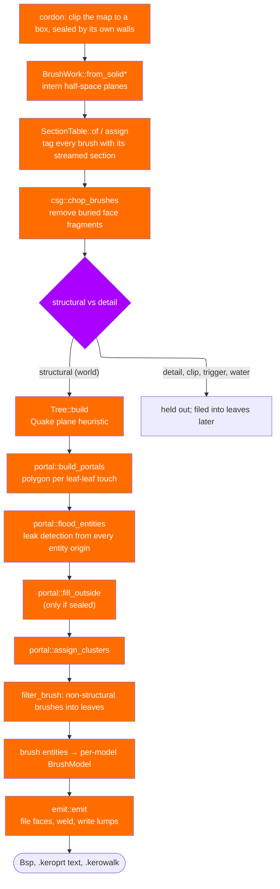
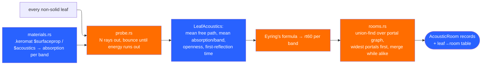
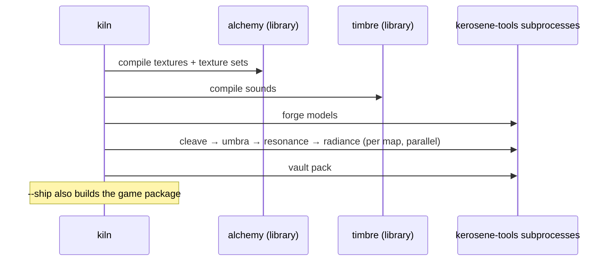

# The map pipeline

A `.keromap` is edited by hand or by Chisel; a `.kerobsp` is what the engine
loads. In between sit four compilers, each a separate crate and a separate
subcommand, each writing back into the same file. This page follows the data.

```mermaid
---
config:
  layout: elk
---
flowchart LR
    map(["maps/x.keromap<br/>KeyValues, brushes as planes"]) --> cleave["cleave"]
    cleave --> bsp0(["x.kerobsp<br/>+ x.keroprt<br/>+ x.kerowalk"])
    bsp0 --> umbra["umbra"]
    bsp0 --> resonance["resonance"]
    umbra --> bsp1(["x.kerobsp<br/>+ visibility"])
    bsp1 --> resonance
    resonance --> bsp2(["x.kerobsp<br/>+ acoustics"])
    bsp2 --> radiance["radiance"]
    bsp1 --> radiance
    radiance --> bsp3(["x.kerobsp<br/>+ lighting"])
    bsp3 --> vault["vault"]
    vault --> archive(["content.vault"])
    archive --> engine(["kerosene runtime"])

    classDef tool fill:#FF6D00,color:#fff
    classDef file fill:#2962FF,color:#fff
    class cleave,umbra,resonance,radiance,vault tool
    class map,bsp0,bsp1,bsp2,bsp3,archive file
```

Resonance reads the portal file Umbra also needs, so it runs after Cleave and
is otherwise independent of Umbra; the engine's `load_map` only *warns* if
any of the three data sets is missing (`bsp.visibility.is_empty()`,
`bsp.lighting.is_empty()`, `bsp.acoustics.is_none()`), because a map is still
playable unlit and unseen.

## Cleave: `.keromap` → `.kerobsp`

Source of truth: `tools/cleave/src/pipeline.rs`, function `compile`. The
stages run in this order and the code comments mark each with `// ---- name ----`.

### Brushes are planes

`kerosene_map::Solid` stores each face as three points; `BrushWork`
(`tools/cleave/src/brush.rs`) interns those into a `PlaneSet` and computes the
face polygon. Plane interning is not a nicety: two faces meant to be coplanar
must share *one* plane index, or the tree splits along a hair's width and the
compile explodes. `kerosene-math/src/plane.rs` holds `PlaneSet` and the
dedup/episode logic.

### CSG rules for coplanar faces

`tools/cleave/src/csg.rs` documents the two subtle cases that decide whether
flush brushes z-fight or leak:

- same plane, same facing (brushes side by side): lower-index brush keeps the
  shared area, the other drops it — exactly one face survives;
- same plane, opposite facing (back to back): both drop it, it is an interior
  seam nothing can see.

### The tree heuristic

`tools/cleave/src/tree.rs` chooses at each step the plane that scores best on
Quake's heuristic: coplanar faces are worth a lot, splits cost, axial planes
get a bonus. Detail brushes are excluded from `Tree::build` entirely — "the
single biggest lever a level designer has over compile time", as
`kerosene-bsp/src/lib.rs` puts it. A leaf learns it is solid in the Quake way:
a solid brush whose every side was used as a node plane on the path down has
been completely carved out of space.

### Portals, leaks, outside removal

`tools/cleave/src/portal.rs` builds portals from six world-box polygons down
the tree. Flooding from every entity origin answers three questions at once:
is the map sealed, which leaves are inside, and what is the connectivity graph.
If the flood reaches outside and `ignore_leaks` is false, Cleave returns
`CompileError::Leaked` **before** filling, because filling a leaking map turns
the whole level solid. Only a sealed map gets `fill_outside`; `assign_clusters`
then numbers the surviving leaves for Umbra.

### Emission

`tools/cleave/src/emit.rs` does three jobs in order: file each CSG fragment
down the tree into the leaf that can see it (dropping fragments in solid
leaves), weld vertices/edges so seams stay watertight (WELD_EPSILON 0.05, well
under `ON_EPSILON`), and write the lumps. The `.keroprt` is written by
`portal::write_prt`; the `.kerowalk` by `tools/cleave/src/walk.rs` from the
same final polygons — so a face CSG cut back to a sliver contributes only the
sliver.

### Tool materials

`tools/cleave/src/material.rs` maps a material name to compiler intent:
everything under `tools/` is special (`tools/clip`, `tools/hint`, `tools/skip`,
…), everything else is ordinary geometry. This is Source's convention and it is
good design: the level designer expresses intent with the same tool they use
for everything else, and it is visible in the 3D view.

### Sections and the cordon

`tools/cleave/src/sections.rs` numbers streamed visgroups after the world
(section 0) and tags each brush and face. A brush may also name its section
with `"section" "name"`. The cordon is the editor's "compile only this box":
the box's own walls seal it so the result does not leak. See
[Rendering and streaming](rendering.md) for what the engine does with sections.

## Umbra: the PVS

Source: `tools/umbra/src/lib.rs`, `flow.rs`, `prt.rs`, `bitset.rs`. It reads
the `.kerobsp` and the `.keroprt`, and writes the visibility lump.

Two passes that tighten on each other (`tools/umbra/src/flow.rs`):

1. **Base vis** — cheap and generous: two portals might see each other if each
   pokes out on the visible side of the other; flood transitively for an
   over-estimate.
2. **Portal flow** — the real answer. Sight from the source portal through a
   chain of portals is a shrinking sight cone, narrowed by *separating planes*
   (a plane touching one edge of the source and one vertex of the portal being
   passed through). When the cone closes to nothing, everything beyond is
   invisible and the recursion stops. `MAX_DEPTH = 128` caps degenerate graphs;
   stopping early is conservative (leaves extra clusters visible), not wrong.

The result is a bit per cluster pair, run-length encoded on zero bytes — the
Quake/Source scheme. `--fast` stops after base vis for iteration. See
[BSP internals and traces](bsp-and-traces.md) for the `VisData` reader.

## Resonance: acoustics

Source: `tools/resonance/src/`. It runs after the portal graph exists and
independently of Radiance — sound and light share nothing but the walls.

A ray meets a surface every `mean_free_path` units and loses
`ln(1 - absorption)` per hit, so energy falls as
`exp(distance * mean_ln / mean_free_path)`; 60 dB is `ln(10^-6)` of that and
distance is time at the speed of sound (`SPEED_OF_SOUND = 13_504.0` ku/s). Air
absorption is one more loss per unit, tabulated per band. The averages are
what Eyring's formula wants, measured in the room's actual shape rather than
assumed for a box.

Leaves are then gathered into rooms (`tools/resonance/src/rooms.rs`): union-find
over the portal graph, widest portals first, merging only while the merged
average still sounds like both halves. A hall the BSP cut into twenty leaves
becomes one hall; a doorway stays a boundary because the two sides disagree.
Leaves too small to probe inherit from the neighbour they share the most portal
with. The record layout is in `kerosene-bsp/src/acoustics.rs`; the mixer reads
it directly.

## Radiance: lightmaps

Source: `tools/radiance/src/bake.rs`, `lights.rs`. Lights are authored as
entities (`light`, `light_spot`, `light_environment`) and read from the
compiled entity lump by `LightSet::from_bsp`. Every lit face carries a grid of
*luxels*; baking one means finding where it sits in the world and asking every
light whether it can see it, then bouncing.

Two details do most of the work of making it look right:

- **Samples land on the surface, not inside it.** The luxel grid covers the
  face's bounding rectangle in texture space, so points near the edge of an
  angled face fall inside neighbouring geometry and bake black, producing a
  dark rim. They are nudged toward the face centre until they clear solid.
- **Shadow rays start slightly off the surface.** Starting exactly on the face
  means the first hit is the face itself and every surface is fully shadowed.

`--samples` (supersampling, 1–8) softens shadow edges at quadratic cost;
`--bounces` controls indirect light; `--fast` is one sample and no bounces.
The result is `ColorRgbExp32` per luxel in the lighting lump, packed at runtime
into an atlas (`crates/kerosene-render/src/lightmap.rs`). Sun direction and sky
colour come from `light_environment`; the engine reads the same `_light` colour
to tint the sky (`Engine::sky_color_from_map`), so a map lit by a warm sun gets
a warm sky without anyone stating it twice.

Last, `tools/radiance/src/probes.rs` bakes the reflection probes: one per
`env_cubemap`, six faces of `--cubemap-size` texels, each texel a ray from the
probe. A ray that escapes is sky; one that lands is the lightmap at that point
times the surface's reflectivity. The face it landed on is found through a
`FaceIndex` bucketed by plane, not through the leaf in front of the hit: a hit
an epsilon off the floor can sit in a thin leaf Cleave filed no faces into.
Only world faces are indexed, since a door is baked where it was compiled.
The result goes in the `cubemaps` lump; a map with no probes has any stale
ones cleared.

## Kiln: the whole pipeline

Source: `tools/kiln/src/lib.rs`. Kiln is the one tool that runs the others. It
re-invokes the same executable with each stage's name as a subcommand, so
"the pipeline is one program" never leaks into the compilers being separate
stages. The stages are `Textures, Sounds, Models, Maps, Pack` (`Stage::ALL`)
and `Ship` (`Stage::EVERY`); `Ship` is deliberately *not* in `ALL`, because
building content is something done every few minutes and assembling a
distribution is not.

Only the texture and sound builds are *library* calls, and for a stated reason
in `tools/kiln/src/lib.rs` and `tools/alchemy/src/lib.rs`: Chisel and Timbre's
own GUI make the same calls, and two callers of one step must not be able to
disagree. Everything else is a subprocess so a compiler that fails does not
take the build down with it.

## Chisel and the editor-side compilers

`tools/chisel` embeds the same algorithms as libraries so the editor can draw
previews and run a compile from F9 without shelling out. Its `compile` module
drives Cleave/Umbra/Radiance as subcommands through `kerosene_vfs::toolchain`,
which is the same path Kiln uses. Chisel depends on `alchemy` in-process
because it builds the content tree's textures on the way to opening its window,
so the editor still works when the only binary present is itself
(`tools/chisel/Cargo.toml` comments this explicitly).

> Next: [BSP internals and traces](bsp-and-traces.md).
