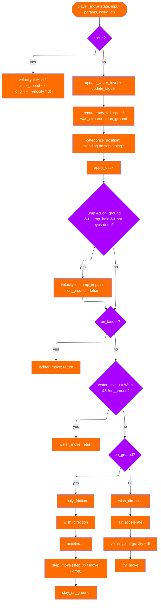
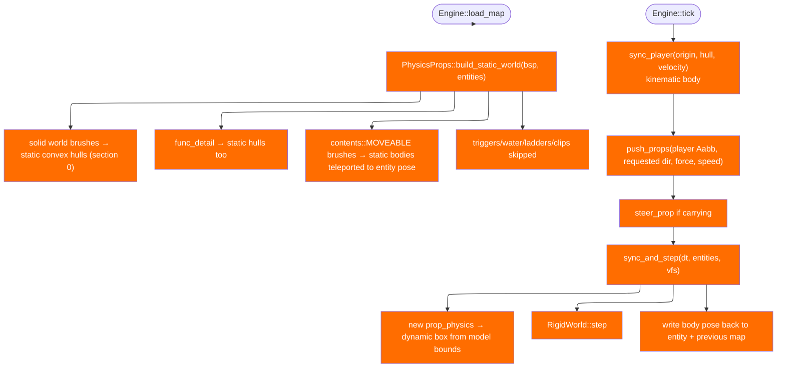

# Physics

Kerosene has **two** physics systems, and keeping them apart is a design
decision, not an accident:

- `kerosene-physics` is a faithful reimplementation of Source's
  `gamemovement`. The way a Source game *feels* is this code — the
  acceleration model, the air-speed cap, the stair-stepping, the sliding
  solver. It stays.
- `kerosene-rigid` wraps [box3d-rust](https://crates.io/crates/box3d-rust) for
  everything the player is not: props that tumble, roll and settle.

`crates/kerosene-engine/src/physics.rs` joins them. `PhysicsProps` owns one
`RigidWorld` and the entity↔body mapping; the engine calls it once per tick.

## Player movement

`crates/kerosene-physics/src/movement.rs`, function `player_move`, in order:



Three ordering details are load-bearing:

- **Friction runs before acceleration** on the ground. Running it after makes
  ground movement mushy and breaks air strafing — the reason is in
  `architecture.md`.
- **Jumping is checked before friction**, so the jump takes full ground speed
  with it rather than a decelerated version.
- **On the ground, `velocity.z` is zeroed and the move is `step_move`**; in
  the air, gravity is applied and the move is plain `try_move`.

### Why air control works

`air_accelerate` caps the **wish speed it considers** at
`MoveParams::air_speed_cap` (30 units/s), not the resulting speed. So the "have
I got enough speed already" test is against 30 rather than the run speed, and a
player already moving at 400 can still gain speed by steering sideways. That
single clamp is the origin of bunny-hopping and surfing; it is preserved
deliberately. The code comment notes the *rate* still scales with the uncapped
wish speed while the ceiling stays at the cap.

### Stair stepping

`step_move` makes two attempts and picks whichever covered more horizontal
ground:

1. move straight along the ground (`try_move`);
2. step up `step_size` (18 units — why Source staircases have 8-unit risers,
   two per step), move, then drop back down.

If the drop lands on something steeper than `MAX_STANDABLE_Z` (0.7 ≈ 45.57°),
the attempt was a wall, not a step. The comparison is strict so a tie goes to
the stepped-up attempt — otherwise sliding to a stop against a step covers
exactly as much ground as stepping onto it and stairs can never be climbed. A
clean step takes the downward velocity so walking up stairs does not launch
you, and is not reported as a wall hit.

### Hulls and water

`STANDING_HULL` is 32 wide × 72 tall with a 64-unit eye height;
`DUCKED_HULL` is the same width at half height. `MAX_STANDABLE_Z = 0.7` is
`cos(45.57°)`, Source's value: the single number that decides which ramps are
stairs and which are slides.

`WaterLevel` is `Dry | Feet | Waist | Eyes`. At `Waist` and above,
`player_move` hands off to `water_move` (Quake's water move): drag scales with
depth, the wish follows the view's pitch, and with no input the player sinks
slowly rather than hanging in place. Ladders are found by
`point_contents_brushes` with `MASK_VOLUMES`, not by a trace, because water and
ladders are non-solid.

### The `CollisionWorld` trait

`crates/kerosene-physics/src/world.rs` defines what movement needs:

```rust
pub trait CollisionWorld {
    fn trace_hull(&self, start, end, mins, maxs, mask) -> Trace;
    fn contents_at(&self, point: Vec3) -> u32;
}
```

`BspWorld` is the real one; `BoxWorld` is a hand-built floor/step/wall used by
the tests. The trait exists so movement can be tested without a compiled map:
testing against a map means debugging the map when a test fails.

`crates/kerosene-engine/src/collision.rs` adds two more worlds. `LevelCollision`
traces the world BSP *and* every brush entity's model separately, taking the
nearest hit — a door is kept out of the world tree so it can move without
re-splitting it. `PlayerCollision` additionally traces the rigid prop boxes, so
the player collides with physics props. Both are rebuilt each tick (the comment
in `Engine::tick` says why: a door that moved must block where it is now, and so
must a prop the player just kicked).

## Rigid-body props

`crates/kerosene-engine/src/physics.rs`. `PhysicsProps` maps entities to bodies:



Key decisions, each stated in the source comments:

- **Units are native.** `kerosene-rigid::init` sets Box3D's length-unit scale
  to `INCHES_PER_METRE` once per process; after that every vector is inches,
  Z-up, with no conversion anywhere. `GRAVITY = (0, 0, -800)`.
- **Static world brushes become convex hulls** so props have something to land
  on. Detail brushes are static geometry already in `bsp.brushes`, so they
  become hulls too. Moving brushes (`contents::MOVEABLE`) become static bodies
  that are re-placed to their entity's pose every tick, so a closed door blocks
  a thrown prop and an open one lets it through. Triggers, water, ladders and
  player/monster clips are skipped entirely.
- **Each prop gets a dynamic box** shaped from its model's bounds, centred on
  the bounds' centre so a model built off-centre still sits where it draws.
  `load_model` fails are cached so a missing `.keromdl` is warned about once.
- **The player is kinematic, not dynamic.** The player's own movement code is
  the authority on where they are; a dynamic body would be shoved around by the
  very props it is meant to shove. Without a body at all the player was a hole
  in the simulation — props fell through them and walking into a crate did
  nothing.
- **Solidity and pushing are separate.** `sync_player` makes props bounce off
  the player; `push_props` lets the player move them. `player_push_direction`
  reads the requested direction, not velocity, because a crate stops the player
  dead and reading velocity would mean the harder you pressed the less you
  pushed.
- **Carrying.** The use key grabs a prop; `Engine` steers it toward a point in
  front of the eye, traced against the world so the hold point does not land
  inside a wall, with the prop's own half-extent kept clear of the surface.
  Yaw follows the player so the grabbed face keeps facing them; pitch and roll
  are preserved so a prop on its side stays on its side. Attack throws it.

`PhysicsProps::previous_pose` records each prop's pose before the step so the
renderer can interpolate a tumbling crate instead of snapping it every 1/64 s.
`debug_lines` feeds the `phys_debug` wireframe overlay.

> Next: [Audio and acoustics](audio.md).
