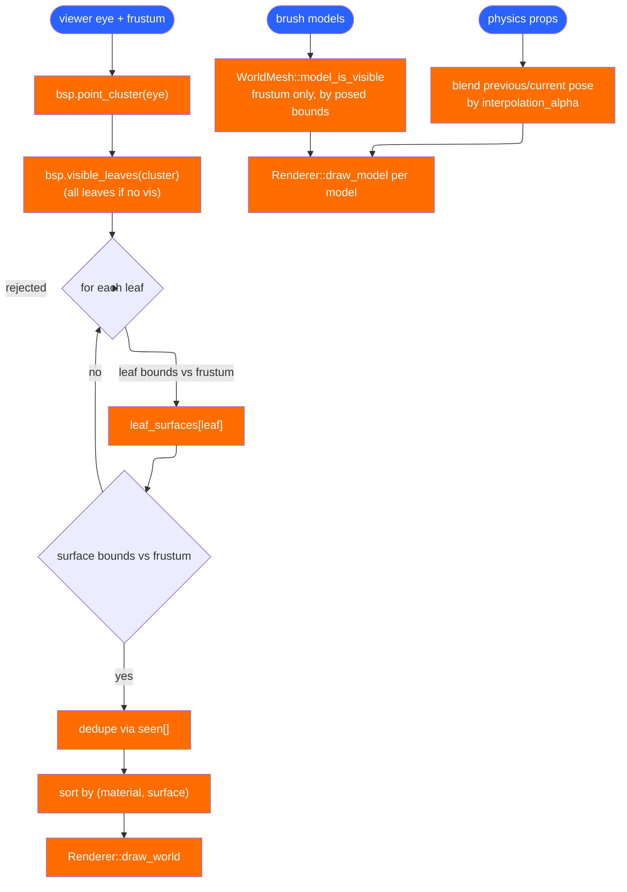
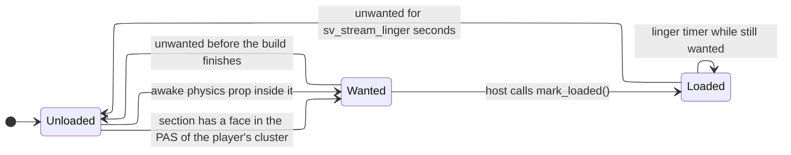

# Rendering and streaming

`kerosene-render` splits cleanly in two: `mesh.rs`, `lightmap.rs` and
`camera.rs` are pure CPU logic that decide *what* to draw and can be tested
without a GPU; `gpu.rs` is the wgpu layer that draws it. The module doc in
`crates/kerosene-render/src/lib.rs` states the frame in four steps: find the
viewer's cluster, take its PVS row, frustum-cull the leaves then their
surfaces, draw what is left batched by material.

## From BSP to triangles

`WorldMesh::build_for(bsp, atlas, keep)` in
`crates/kerosene-render/src/mesh.rs` turns the compiled faces into
`WorldVertex { position, normal, uv, lightmap_uv, tangent }` plus an index
buffer. Two coordinate conversions happen here and nowhere else:

- **Winding order.** Faces are stored clockwise seen from the front (the
  brush-file convention). GPUs treat counter-clockwise as front-facing, so the
  triangle fan is emitted reversed.
- **UVs.** `texinfo` produces texels; shaders want them normalised by the
  texture size, so the atlas and material coordinates are divided at build
  time.

The tangent is read from the texture projection, not derived from the
triangles. `texinfo` already stores the world direction u increases along, and
that *is* the tangent; deriving it from geometry would agree only by
coincidence and light a normal map from the wrong side wherever it did not.
The bitangent's sign lives in `tangent.w`, which is what stops mirrored text
from lighting inside out.

Faces are grouped by material first and the groups are **sorted**, so batch
order and the index buffer are byte-identical between runs. A `Batch` records
`contiguous_range` when every surface in it is contiguous in the index buffer,
which lets the whole world draw in as many calls as it has materials rather
than one per face.

Two mappings are built after the surfaces:

- `leaf_surfaces: Vec<Vec<u32>>` — surface indices per BSP leaf, for PVS
  culling.
- `model_surfaces: Vec<Vec<u32>>` and `model_bounds` — surface indices per brush
  model. This exists because **brush entities are compiled as their own models
  and their leaves are not in the world's PVS**. A leaf walk finds the world
  and nothing else. A comment in `WorldMesh` records the war story: every brush
  entity in every map was once built into the mesh and never drawn, and the
  sample map's door was simply not there.

## What to draw

`WorldMesh::visible_surfaces` does the leaf walk: the PVS removes rooms you
cannot see through any opening, the frustum removes what is behind you, and
neither subsumes the other. It sorts the surviving surface indices by
`(material, surface)` so `gpu.rs`'s draw loop rebinds a material only when it
actually changes.

Brush models deliberately skip the PVS. `model_is_visible` culls by frustum
against the *posed* bounds (the enclosing box of the turned box, because a
frustum test wants an axis-aligned answer). The comment is explicit: a brush
entity could be leaf-tested, but there are a handful of them, they are the
things the player walks up to, and culling one wrongly costs far more than
drawing it.

### Interpolation

`Engine::interpolated_brush_model_poses(alpha)` blends each model's previous
and current `(origin, angles)` and rebuilds its `Pose` around the model's own
compiled centre. The centre comes from the model's bounds rather than a
keyvalue — a brush model is built in world coordinates, so there is no other
point that means "spin where you stand". Collision traces the raw current-tick
pose; only the drawn pose lags by up to one tick, the same as the camera.

Physics props each take a model slot in the host's `draw` and draw where their
body is, blended from `PhysicsProps::previous_pose`. `MAX_MODELS` slots are
uploaded as a single `update_models` uniform array with a dynamic offset — see
`gpu.rs`, `ModelUniform`.

## Lightmaps

`crates/kerosene-render/src/lightmap.rs` packs every face's per-luxel grid into
one 2048² atlas (`ATLAS_SIZE`) so the world draws without a texture bind per
face. The packer is a shelf packer: sort by height, lay pages out in rows. It
is not optimal, but lightmap patches are small and similar-sized, which is
exactly what shelf packing handles well — and being deterministic matters more
than the last few percent of occupancy, because a map that packs differently
between runs invalidates every cached atlas.

`PADDING = 1` blank texel around each patch, because bilinear filtering at a
patch's edge otherwise samples its neighbour and every surface picks up a thin
bleed. `AtlasRect::to_uv` insets a half-texel so a sample at luxel 0 lands at
the centre of the first texel. `overflowed` counts faces that did not fit; they
draw unlit and the host warns, suggesting a coarser lightmap scale.

The atlas is built at unit exposure, and `mat_exposure` is applied live in the
shader. Folding exposure into the atlas as well squared it and froze half of it
at load time — a bug the host comment records.

## The wgpu layer

`crates/kerosene-render/src/gpu.rs` is deliberately thin: every *what* decision
is already made by `visible_surfaces`, so this is buffer management, pipeline
setup and a draw loop. Materials each get their own bind group; surfaces arrive
sorted by material, so the loop rebinds only when the material changes.

`CameraUniform` carries `view_proj`, `position`, and a `params` vector of
`[exposure, time, lightmaps_enabled, fullbright]` plus bump/specular scales and
the sky colour. `ModelUniform` is a full transform, not a displacement — the
comment notes it was three floats until rotated brush entities showed up. Props
are drawn through `draw_studio_model`; debug overlays (prop boxes, streaming
bounds, acoustic rooms) are `LineVertex` streams uploaded per frame.

`crates/kerosene-render/src/camera.rs` does the coordinate conversion once:
Kerosene is Z-up +X-forward, graphics APIs want +X-right +Y-up −Z-forward. FOV
is specified *horizontally* (`REFERENCE_ASPECT = 4/3`) because that is what a
player judges, and is converted to the vertical angle the projection matrix
wants, so a widescreen monitor shows more at the sides rather than stretching.

## Streaming

`crates/kerosene-engine/src/streaming.rs` decides which sections are resident.
It only decides; the host builds and drops GPU data and reports back with
`Streaming::mark_loaded`, and physics syncs hulls on a state change.

The rule is potential *audibility*: a section is wanted when any of its faces
sits in a cluster the player's cluster can **hear** — the PAS, the PVS flooded
one doorway further. A room therefore starts loading a doorway before it can
be seen, and that doorway is the margin that hides the build. A section that
stops being wanted lingers `sv_stream_linger` seconds so pacing over a
threshold does not thrash. With no vis data, with the player outside the world,
or with `sv_stream 0`, everything is wanted.

What streams is only the expensive part: the render mesh, the lightmap atlas
and the rigid-body hulls. The BSP tree, the entity list, the player's traces
and entity I/O are whole whatever is loaded — the tree is small, traces must
work everywhere, and a `logic_relay` in an unloaded room still fires. Brush
entities are never streamed: a door is drawn and collided with wherever it has
moved to.

The host side is `App::stream_sections`: it spawns a worker thread per wanted,
not-yet-resident section to build `WorldMesh` + `LightmapAtlas` from the shared
`Arc<Bsp>`, and uploads on the main thread when the `mpsc` receiver delivers.
`mark_loaded` ignores a build that finishes after the section was dropped
again, so a stale build cannot resurrect it. `r_stream_debug 1` draws each
section's bounds in the colour of its state
(`section_debug_lines` in `host.rs`).

This is sections of *one map*, not an open world: everything is still one
`.kerobsp`, compiled and lit as one.

> Next: [Physics](physics.md).
