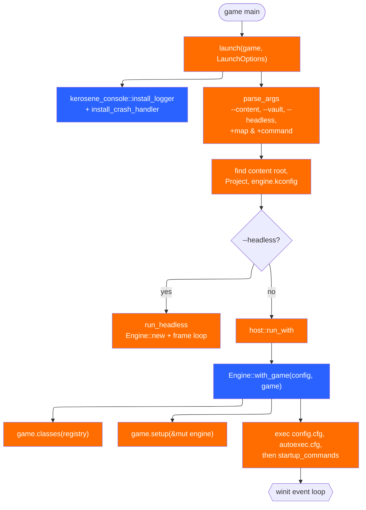
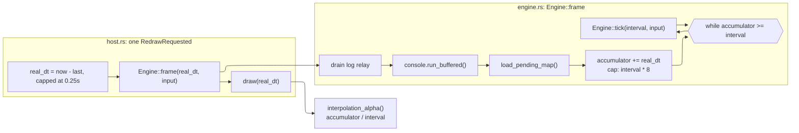
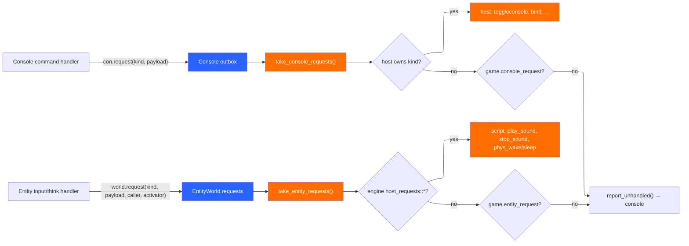

# Runtime and the tick

The runtime is two layers with a hard boundary between them:

- `Engine` (`crates/kerosene-engine/src/engine.rs`) is the whole simulation.
  It has no window, no GPU and no input device.
- `host` (`crates/kerosene-engine/src/host.rs`) owns the winit event loop,
  the wgpu surface and egui, and calls `Engine::frame` once per redraw.

`crates/kerosene-engine/src/lib.rs` states the reason plainly: refusing to
start a server without a GPU would be a serious mistake in an engine meant to
host multiplayer games, so the boundary is enforced by `Engine` not knowing
what a surface is. `--headless` in `crates/kerosene-engine/src/launch.rs` runs
`Engine` alone for a fixed tick count.

## From `main` to the first tick



`Engine::with_game` is where the order is decided. The game is asked for its
classes and gets `setup` **after** the console exists but **before**
`config.cfg`, `autoexec.cfg` and the command line run — so a convar a game
registers in `setup` can be set from any of the three. The VFS is built first
and wrapped in an `Arc`; archives mount after directories so loose files win.

## The fixed tick vs the render frame

Source's defining property, kept exactly: simulation runs at a fixed rate and
rendering runs as fast as it can, interpolating between the last two
simulation states.



The accumulator cap is deliberate: a breakpoint or a window drag must not
produce hundreds of catch-up ticks that look like the world fast-forwarding.
The cap is `tick_interval() * 8.0` in `Engine::frame`.

`Engine::tick_rate` reads `sv_tickrate` (default 64, `DEFAULT_TICKRATE`).
`Engine::interpolation_alpha` returns `accumulator / tick_interval()` in
`0..=1`; the host uses it to blend the view (`Engine::interpolated_eye`) and
brush-model poses (`Engine::interpolated_brush_model_poses`). The host takes
the *latest* input for view angles and blends only positions, which is why the
camera feels responsive at frame rate rather than tick rate.

## One tick, in order

`Engine::tick` reads top to bottom in `crates/kerosene-engine/src/engine.rs`.
The order is not arbitrary; several steps only work because of where they sit.

```mermaid
---
config:
  layout: elk
---
flowchart TB
    A["time += dt; tick_count += 1<br/>previous_origin = movement.origin"] --> B["view_angles = input.view_angles.clamped_view()"]
    B --> C["entities.set_trace(developer &gt;= 2)"]
    C --> D["game.pre_tick(engine, input, dt)"]
    D --> E["build PlayerCollision for this tick"]
    E --> F["movement_params() from sv_* convars"]
    F --> G["kerosene_physics::player_move(...)"]
    G --> H["fall damage if landed fast"]
    H --> I["update_footsteps(dt)"]
    I --> J["write player origin back to its entity"]
    J --> K["audio.set_listener(eye, view basis)<br/>set_volume; update_acoustics()"]
    K --> L["use key edge → use_what_is_in_front()"]
    L --> M["attack edge → throw_held_prop()"]
    M --> N["snapshot previous_brush_poses"]
    N --> O["update_triggers(dt)"]
    O --> P["entities.run(dt)<br/>deliver events, thinks, reclaim removals"]
    P --> Q["take_entity_requests()<br/>engine host_requests"]
    Q --> R["game.tick(engine, input, dt)"]
    R --> S["physics: sync_player, push_props,<br/>steer held prop, sync_and_step"]
    S --> T["update_streaming(dt)"]
    T --> U["script on_tick hook, if defined"]

    classDef movement fill:#2962FF,color:#fff
    classDef entities fill:#AA00FF,color:#fff
    classDef physicsC fill:#00C853,color:#fff
    class G,H,I movement
    class P,Q,R,U entities
    class S physicsC
```



Points worth calling out:

- **`pre_tick` runs before movement** specifically so a game can change speed,
  gravity or jump permission before the movement reads the convars
  (`movement_params`).
- **`game.tick` runs after entity I/O but before the rigid-body step.** The
  module doc in `game.rs` states this: "the player has moved, triggers have
  fired, entities have thought and their requests are answered. Physics props
  have not yet stepped."
- **`previous_brush_poses` is snapshotted before `entities.run`**, so a door
  that thinks and moves this tick has both endpoints for interpolation.
- **The player's box is synced into the rigid world before props step**, so a
  prop meets the player where they are this tick. Solidity and pushing are
  separate: `sync_player` makes props bounce off the player, `push_props`
  lets the player move them. `player_push_direction` reads the *requested*
  direction, not velocity, because a crate stops the player dead and reading
  velocity would make leaning on a crate do nothing.

## The `Game` trait

Defined in `crates/kerosene-engine/src/game.rs`; every method has a
do-nothing default, and `()` implements it (what `Engine::new` uses).

| Hook | When | Typical use |
|---|---|---|
| `classes(&mut ClassRegistry)` | once, at engine construction | register entity classes |
| `schema() -> &'static str` | tools only | `.kerodef` text for the inspector |
| `setup(&mut Engine)` | console up, no map loaded | register convars/commands |
| `map_loaded(&mut Engine)` | after entities spawn, player placed, map script ran | per-map state |
| `pre_tick(&mut Engine, &InputState, dt)` | before movement | change movement |
| `tick(&mut Engine, &InputState, dt)` | after I/O, before props step | game rules |
| `entity_request(&mut Engine, &HostRequest) -> bool` | unclaimed entity request | custom host verbs |
| `console_request(&mut Engine, kind, payload) -> bool` | unclaimed console request | custom console verbs |
| `wants_ui() -> bool` | every frame | opt into the UI layer |
| `ui(&mut Engine, &egui::Context)` | when wanted / mouse free | HUD, menus |

The re-entrancy rule is implemented in `Engine::with_game_mut`:

```rust
pub(crate) fn with_game_mut<R>(
    &mut self,
    f: impl FnOnce(&mut dyn Game, &mut Engine) -> R,
) -> Option<R> {
    let Some(mut game) = self.game.take() else { /* log + skip */ return None };
    let out = f(game.as_mut(), self);
    self.game = Some(game);
    Some(out)
}
```

`self.game` is `Option<Box<dyn Game>>`, `None` only while a hook runs.
`Engine::game()` returns `None` during a hook. `map_loaded` loading another
map must go through `Engine::request_map`, which sets `pending_map` and is
drained by `load_pending_map` at the top of the next `frame` — before the
accumulator, so the map change cannot be missed by a long frame.

## Requests: console and entity

The engine's own I/O is request-shaped for the same reason the game seam is:
a handler must not be able to reach arbitrarily back into the engine.



`host_requests` in `crates/kerosene-entity/src/world.rs` is the short list the
engine knows (`script`, `script_call`, `script_file`, `play_sound`,
`stop_sound`, `phys_wake`, `phys_sleep`). Anything else is offered to the game
and, if declined, printed as unknown. The console's `requests` module is the
same shape, and the host claims `toggleconsole`, `bind`, `unbind`, `unbindall`
and `bind_list` — that is why the console toggle is bindable like any command.

## Input and the console

`crates/kerosene-engine/src/input.rs` holds `InputSystem`. Keyboard and mouse
events name a *command* and `console.execute_user` runs it; movement uses
convars through `HeldActions`/`InputState` rather than hard-coded keys, so
`+forward` is rebindable. The host intercepts the console key (`intercepted()`)
before anything else, on press and not repeat, because a focused text field
otherwise eats the very key that closes the console. While the console is open
the game sees no keys and held movement is released; the same happens on
`WindowEvent::Focused(false)` so an alt-tab does not leave the player running.

## The host frame

`App::frame` in `crates/kerosene-engine/src/host.rs`:

1. `real_dt` from `Instant`, capped at 0.25 s.
2. `input.update_view(&console)` and `input.state()`.
3. `set_host_paused(console open || background)` and `set_background(..)`:
   the engine decides from those, the pause menu and `sv_pause_on_menu`
   whether it is paused (`Engine::is_paused`). Paused, `frame` runs the
   console and pending loads but no ticks, and empties the accumulator so
   unpausing is not a burst of catch-up ticks.
4. `engine.frame(real_dt, &input_state)` — zero or more ticks.
5. Drain console requests the engine did not claim (host verbs), report the rest.
6. `quit_requested()` → exit.
7. Rebuild GPU resources if `load_generation()` changed (by generation, not
   name, so reloading a recompiled map shows new geometry).
8. `stream_sections()` — build wanted sections on worker threads, upload on
   this thread.
9. `draw(real_dt)`, unless the window is occluded (minimised or covered),
   when it sleeps 20 ms instead.
10. Sleep to honour `fps_max`, measured from the frame's start.

`rebuild_map` builds section 0 (the world) synchronously and records
`LoadedMap { generation, sections, building, tx, rx }`. `stream_sections`
spawns a thread per wanted, not-yet-resident section to build `WorldMesh` +
`LightmapAtlas` from the shared `Arc<Bsp>`, and uploads when the `mpsc`
receiver delivers. `Engine::section_loaded` then calls `sync_sections` so the
rigid hulls match what is resident. See [Rendering and streaming](rendering.md).

> Next: [The map pipeline](map-pipeline.md).
