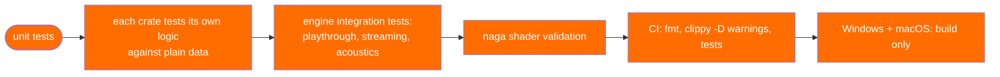

# Testing

Where a subsystem can be tested without a GPU or a window, it is. This is not
an aspiration; it is why several types are shaped the way they are. This page
lists the seams that make it possible and the tests that cross them.

## What is deliberately not in the testable path

| Testable | Depends on | Enabled by |
|---|---|---|
| Whole simulation | nothing | `Engine` has no surface |
| Player movement | a `CollisionWorld` | the trait, and `BoxWorld` |
| Entity I/O | `EntityWorld` | handlers take `&mut EntityWorld` only |
| Scripts | a `WorldView` snapshot | scripts return `ScriptAction`s |
| Rendering decisions | `Bsp` + `WorldMesh` | `mesh.rs`/`lightmap.rs` are CPU-only |
| Shaders | `naga` | same compiler wgpu uses |
| Audio mixing | buffers | `mixer.rs` has no device |
| Compilers | plain data | each stage is a pure function |
| The editor | the library | egui is only the drawing layer |

## Movement against a hand-made world

`crates/kerosene-physics/src/world.rs` defines `CollisionWorld`, implemented by
`BspWorld` for real maps and `BoxWorld` for tests. `BoxWorld` is a floor, a
step, a wall and a volume; the tests in
`crates/kerosene-physics/src/movement/tests.rs` (855 lines) pin down every rule
— friction, the air-speed cap, stair stepping, sliding — against a world whose
expected answer is obvious. Testing movement against a compiled map means
debugging the map when a test fails.

The `test-world` feature exposes `BoxWorld` to other crates without compiling
it into a release build.

## Entity I/O without an engine

Class handlers are `fn(&mut EntityWorld, EntityId, …)`. That is the whole reason
the trait uses function pointers and not closures over an engine: a test can
call `EntityWorld::spawn`, `load_from_kv`, `fire_output`, `run`, and assert on
the result with no `Engine` in sight. `crates/kerosene-entity/src/world/tests.rs`
does exactly that, including the queue ordering and generation-reuse cases.

## Scripts as pure functions

`crates/kerosene-script/src/lib.rs` tests scripts against a hand-built
`WorldView` and asserts on `take_actions()`. Because a script run is a pure
function of the snapshot, the same script run twice on the same world does the
same thing — which is a property that can be asserted, not hoped for.

## Shaders through naga

`crates/kerosene-render/src/gpu.rs` has a test module (around line 1513) that
parses and validates every WGSL string with `naga`, the same compiler wgpu uses
internally. A typo therefore fails in CI on a headless runner rather than at
pipeline creation on a machine with a display — the only machine where the bug
would otherwise appear.

## The whole pipeline: the engine's integration tests

`crates/kerosene-engine/tests/` holds three suites that go through the entire
stack, because each crate can pass its own tests and still not add up to a
level you can walk around:

- `playthrough.rs` — build a map in memory, compile it through Cleave, load
  the `.kerobsp`, spawn entities, move the player, fire inputs, walk through a
  door.
- `streaming.rs` — a hall of four rooms; the far room's crates are in a
  streamed visgroup and the section comes and goes as the player approaches
  and leaves.
- `acoustics.rs` — the whole acoustic chain: a map compiled through Cleave,
  Umbra and Resonance, loaded by the engine and *listened to*, asserting that
  the room the compiler wrote is the room the engine hears and that a wall the
  compiler saw is a wall the mixer muffles.

The common fixture `tests/common/mod.rs` is the stock game as a `Game` impl, so
these suites exercise the same class handlers a real project would.

## The compiler tests

Each compiler has its own tests for the stage it owns — `tools/cleave`,
`tools/umbra`, `tools/radiance`, `tools/resonance` — and the engine's suites
are where their outputs meet. Cleave is a library (`tools/cleave/src/lib.rs`,
`pipeline::compile`), so a test builds a map without shelling out and without a
temporary file in between. That is also why Chisel and Kiln can both drive the
same compile.

## CI

`.github/workflows/ci.yml`:

- **Linux** runs `cargo fmt --all --check`, `cargo clippy --workspace
  --all-targets -- -D warnings` and `cargo test --workspace`.
- **Windows and macOS** build only. The point of those two is to find out the
  tree still compiles there, which is the question nobody at a Linux desk can
  answer by hand.

Tool crates are compiled at `opt-level = 2` in the dev profile
(`Cargo.toml`), because a debug build of Cleave/Umbra/Radiance is brutally slow
and an unoptimised Chisel 3D pane is the difference between an editor you can
drag around and one you cannot.

> Back to [Architecture notes](README.md).
