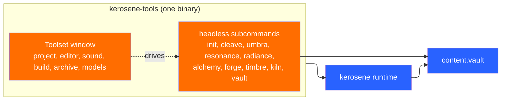
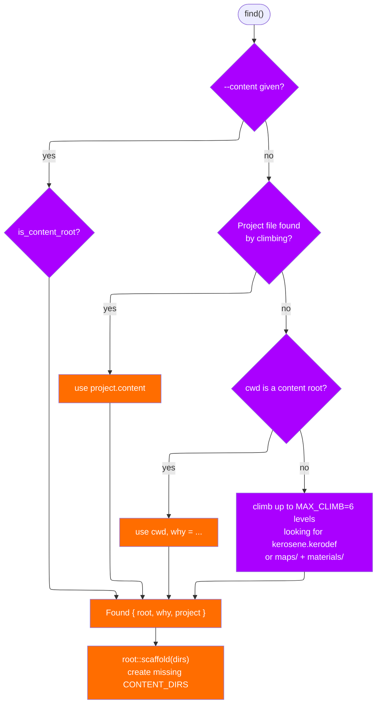
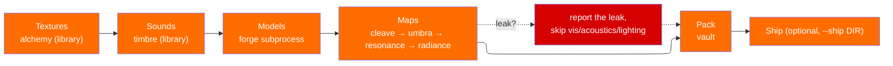

# Tools and the build

The toolset is one executable that contains ten tools, plus `kiln`, which
drives the others. This page is how a project is found, how the tools find each
other, and how a distribution is assembled safely.

## The boundary



`crates/kerosene-vfs/src/toolchain.rs` is the practical definition. A
*subcommand* is always present because it is compiled into the executable and
run by re-invoking that same executable with the subcommand as its first
argument (`toolchain::command`). This preserves the old crash-isolation
property: a compiler that fails does not take the editor down with it. The
*runtime* is a sibling binary first and on `PATH` second, because a checkout and
an install both put the two in one directory.

`tools/kerosene-tools/src/lib.rs` lists the subcommands in one `SUBCOMMANDS`
array and dispatches them in `run_subcommand`. `tools/kerosene-tools/src/entry.rs`
turns the binary into a function, `main_with(Options)`, so a game can ship its
own tools that know its classes:

```rust
const SCHEMA: &str = include_str!("../content/mygame.kerodef");
fn main() -> anyhow::Result<()> {
    kerosene_tools::main_with(
        kerosene_tools::Options::new("mygame-tools", env!("CARGO_PKG_VERSION"))
            .schema(&[SCHEMA])
            .game("mygame"),
    )
}
```

`Options::runtime()` returns a `Runtime::Package` built from the working
directory, so F9 in the editor and `play` build and launch the game rather
than a binary called `kerosene`.

Two subcommands exist for game crates rather than for content:

- **`new`** (`src/new.rs`) writes a game crate from the templates in
  `src/new/template/`: a package, its toolset binary, cargo aliases, a
  project file and a starter map built with `kerosene-map`. It depends on the
  Kerosene the toolset was built from: the checkout's path, the release tag
  when installed from git, or the crates.io version.
- **`play`** (`src/play.rs`) runs Kiln's content stages incrementally, with
  the maps' expensive passes skipped unless `--full`, then
  `toolchain::resolve` to build and run the game.

Kiln decides what is current by file times: an output no older than its
source is skipped, a map also needs a `.kerobuild` stamp saying it was built
at least as thoroughly as asked (`fast` or `full`), and the archive is
skipped when nothing it would pack is newer than it. `--force` rebuilds
everything.

## Finding the content

`crates/kerosene-vfs/src/root.rs`. Every tool needs the same answer to "where
is the content", and when each worked it out its own way they disagreed — and
disagreeing about a directory looks, from the outside, like every one of them
being broken in a different way.



`is_content_root` accepts a `kerosene.kerodef` file as the strong signal, or a
directory with both `maps` and `materials` — a project that has not written its
class definitions yet is still a project. `Found.why` records which rule fired,
so a wrong guess explains itself; a wrong guess that explains itself costs a
minute and a silent one costs an afternoon.

`CONTENT_DIRS = ["maps", "materials", "art", "textures", "models", "sound",
"scripts"]` and `scaffold` creates any that are missing. A project can overrule
the list with repeated `"dir"` keys (`Project::dirs`), and those names go
through the same `path::normalize` the VFS uses, so `..` or a drive letter is
refused.

## The project file

`crates/kerosene-vfs/src/project.rs`. `.keroproj` is a project's own account of
where its content is. Everything before it *infers* the root by climbing the
tree, which works for a fresh clone but is a guess that can be wrong in ways
nobody can correct. A project file sits at the top, names the content directory
relative to itself, and every tool that finds it stops guessing.

| Key | Meaning |
|---|---|
| `name` | title-bar name; defaults to the file stem |
| `content` | content tree, relative to the file; falls back to `content/` or the file's directory |
| `startmap` | map to load when nothing else says which (optional) |
| `game` | the Cargo package that *is* the game; `kiln --ship` builds it and F9 launches it |
| `bin` | that package's binary, when not the package's own name |
| `dir` | repeatable; overrides `CONTENT_DIRS` |

Everything but the block itself is optional. A content-only project has no
`game` and runs and ships the engine's own runtime instead.

## The VFS

`crates/kerosene-vfs/src/lib.rs` is a stack of search paths forming one virtual
content tree. Each `SearchPath` is a directory or a mounted `.vault` plus an
`id` (`GAME`, `MOD`, `PLATFORM`). Lookups are case- and separator-insensitive
(`Materials\Dev\Grid.keromat` finds `materials/dev/grid.keromat`), which a loose
tree has to agree on or a game works from a checkout and breaks the moment it
is packed. Traversal cannot escape the root (`path::normalize`).

A `read_normalized` that hits a permissions error surfaces it rather than
falling through to a stale copy in a lower layer. Writes land in the first
*directory* layer; archives are read-only by design, because mutating a mounted
archive under a running engine would invalidate every offset it has cached.
`write_atomic` in the same file writes to a sibling temp and renames, so a crash
mid-save cannot truncate a map someone spent a day on.

### The `.vault` format

`crates/kerosene-vfs/src/archive.rs`. `MAGIC = "KVLT"`, version 1, header 40
bytes, then a directory of `entry_count` records sorted by path, then a data
blob:

```text
[ header 40 bytes ]
[ directory: path_len:u16, path, crc32:u32, offset:u64, size:u64 ]
[ data blob ]
```

Paths are stored normalised, so lookup is a binary search with no per-query
allocation. Every read is checked against the stored CRC32: a corrupt archive
is a common failure (truncated download, bad copy) and is far better caught
here than as a garbled texture three subsystems later. Loose files win over
packed ones, which is the mod-development workflow — drop a file next to a
shipped archive and it takes effect with no repack.

## Kiln

`tools/kiln/src/lib.rs`, `build(settings)`. Stages run in a fixed order;
`--only` names one for iteration.



- **Textures** and **Sounds** are *library* calls, not subprocesses. The reason
  is in `tools/kiln/src/lib.rs` and `tools/alchemy/src/lib.rs`: Chisel and
  Timbre's own GUI make the same calls, and two callers of one step must not be
  able to disagree.
- **Models**: `art/props/crate.obj` becomes `models/props/crate.keromdl` — the
  path under `art` is the path under `models`, so a model's name is decided by
  where its source is.
- **Maps**: each `.keromap` goes through all four compilers. A leak is
  *reported* rather than fatal to the whole build (finding out at the end of a
  forty-map build beats finding out on the first), and the remaining stages are
  skipped unless `--ignore-leaks`.
- **Pack**: `vault` packs the content tree into the project's archive
  (`Settings::archive`, inside the content tree where a shipped game keeps it).
- **Ship** is deliberately *not* in `Stage::ALL`: building content is something
  done every few minutes, assembling a distribution is not.

`Settings` mirrors the CLI and `Report` collects counts for the toolset's
output panel. `--fast` passes through to Umbra and Radiance; `--dry-run` says
what would run.

### Ship

`tools/kiln/src/ship.rs`. A game is an executable, an archive, a project file
telling the executable where the archive is, and the notices the licences
require, arranged so double-clicking works:

```text
dist/
  my_game            the game, or the engine runtime when a project has none
  my_game.keroproj   content = "content", so the game finds its own archive
  content/
    my_game.vault
  LICENSE            GPLv3 full text
  LICENSE-EXCEPTION  the Kerosene Exception, full text
  README.txt         the notices the licence asks for
```

The doc in `ship.rs` names the two opposite failure modes. Shipping too little
is the common one (forgotten licence texts, because nothing breaks), so they are
written by code, compiled into `kiln` so shipping works from a directory that is
not a checkout. Shipping too much would put Chisel and the compilers in a
player's hands — and that is not merely wasted space, because the tools are
ordinary GPL binaries and distributing one obliges you to distribute its source
too. So `ship` copies a *named list* of files, and a test asserts no tool ever
appears in the result.

## The toolset window

`tools/kerosene-tools/src/toolset.rs` holds `Toolset` with six tabs
(`Project, Editor, Sound, Build, Archive, Models`) switched by an activity bar
and `ctrl-1`..`ctrl-6`. Each tab is the tool it used to be: `ChiselApp`,
`timbre::gui::Timbre`, `loupe`, and the project/build/archive panels in
`tools/kerosene-tools/src/panels.rs` and `project.rs`. One output panel
(`kerosene_toolui::output::OutputPanel`) receives every job's log.

`tools/kerosene-tools/src/project.rs` is where the window opens. It counts
maps, compiled maps, materials, models, sounds and scripts so a person arriving
does not have to guess which project this is or what state it is in.

`tools/chisel` is the editor proper. Its *logic* — document and undo, grid,
viewport projection/picking, tools, compile pipeline — lives in the library and
is tested without a window; the egui layer only draws it and turns clicks into
calls (`tools/chisel/src/lib.rs`). That split is deliberate: an editor that can
only be tested by clicking is an editor whose bugs are found by its users.

> Next: [Testing](testing.md).
