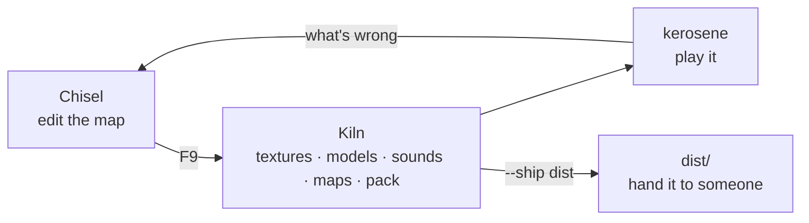

# Making a game

This section is for people who want to *build something on* Kerosene, as
opposed to people working on Kerosene itself. The rest of the book describes
the engine from the inside; these pages describe it from where a game
developer stands: what a project is, what it looks like on disk, how it gets
built, and what has to be true before you hand it to somebody.

> [!WARNING]
> Kerosene is pre-alpha. Everything described here works, but the list of
> things a finished game needs and the engine does not yet have is long — see
> [Publishing](publishing.md#you-can-but) and
> [Missing features](../docs/missing-features.md) before you commit to it.

## Two shapes of project

A Kerosene project is a directory with a `.keroproj` file at the top and a
content tree beside it. There are two kinds, and the difference is one key.

**A content-only project.** Maps, materials, models, sounds and scripts, and
nothing compiled. The game binary is the stock `kerosene` runtime, unmodified.
All of the behaviour comes from entity I/O wired in Chisel and from Rhai
scripts (see [Scripting](../docs/scripting.md)), using the entity classes
that ship in `kerosene-game`. This is a mod, in Source's sense, and it is the
cheaper of the two by a long way: no Rust, no build of the engine, nothing to
maintain when the engine moves.

**A game crate.** Your own Rust binary, depending on `kerosene`, with your
own entity classes and rules. This is what you want when the stock classes
are not enough — a weapon, an inventory, an NPC — because those cannot be
scripted: Rhai is deliberately sandboxed and cannot allocate an entity, touch
the renderer or open a file. The engine is a dependency, never a fork: your
crate implements one trait, `Game`, and hands it to `launch`; nothing in the
engine's source is edited to add a mechanic. [A game crate](#a-game-crate)
below is the whole of it, and the stock `kerosene` runtime is the same thing
with the stock game: `apps/kerosene/src/main.rs` is five lines.

The key that turns one into the other is `game`.

## The project file

```text
project
{
    "name"     "My Game"
    "content"  "content"
    "startmap" "mg_intro"
    "game"     "my-game"
}
```

| Key | Means | If absent |
|---|---|---|
| `name` | What the title bar and the shipped `README.txt` call it | The file's own name |
| `content` | The content tree, relative to the project file | `content/` beside the file, then the file's directory |
| `startmap` | The map `kerosene` loads with no `+map` | Nothing loads until something says `+map` |
| `game` | The Cargo package whose binary *is* the game: built and launched by F9, built and copied by `kiln --ship` | The stock `kerosene` runtime runs and ships instead |
| `bin` | That package's binary, when it is not named after the package | The package name |
| `dir` | Repeatable: the directories the content tree is made of, when the standard set is not wanted | The standard set below |

`content` is relative so the project can be cloned or moved and still be
right. Every tool and the engine find the project the same way, with the same
code, so there is one answer to "where is the content" and each program says
which answer it took. The full account is in
`crates/kerosene-vfs/src/project.rs`.

## The content tree

```text
content/
  engine.kconfig      renderer, window size, vsync — written on first run
  art/                source textures (.png) and meshes (.obj)
  textures/           texture *sets*: colour, normal, roughness… per folder
  materials/          .keromat — hand-written KeyValues
  models/             .keromdl, compiled by Forge from art/
  maps/               .keromap (yours) and .kerobsp (compiled)
  sound/              .wav / .flac / .mp3 sources and compiled .keroaud
  scripts/            .keroscript (Rhai) and the .kerosnd sound table
  <name>.vault        the archive Kiln packs everything into
```

Sources and build outputs sit side by side on purpose: every `.obj` under
`art/` becomes a `.keromdl` at the matching path under `models/`, and every
`.keromap` under `maps/` becomes a `.kerobsp`. There is no list to keep up to
date. Commit the sources; the compiled files are outputs and reproducible.

`engine.kconfig` always exists once anything has run — the first program to
look for it and not find it writes the defaults. See
[Configuration](../docs/configuration.md).

## The loop



Day to day:

```sh
cargo run --release -p kerosene-tools -- chisel content/maps/mg_intro.keromap
kerosene-tools kiln                  # or the Build tab, or F9 in Chisel
kerosene                             # loads startmap
```

Chisel's `F9` compiles the current map and launches the engine on it, and
builds any textures added since the editor opened. `kiln --only maps --fast`
skips the visibility and lighting passes while a layout is still moving; an
unvised, unlit map loads and plays, it just draws everything and looks flat.

Everything Kiln does is also a subcommand you can run by hand or from a build
server — `cleave`, `umbra`, `resonance`, `radiance`, `alchemy`, `forge`,
`timbre`, `vault`
— and [Tools](../docs/tools.md) is the reference for each.

When the game is ready for other people, the last stage is
`kiln --ship <dir>`, and [Publishing](publishing.md) is about what that does
and what it cannot do for you.

## A game crate

The engine is one crate, `kerosene`, and a game is a crate that depends on
it. Nothing else of the engine is named; every engine crate is a module of
it (`kerosene::engine`, `kerosene::entity`, `kerosene::math`, …), and so are
the third-party crates your own signatures mention — `kerosene::egui`,
`kerosene::glam`, `kerosene::rhai` — so the versions can never disagree.

You need Rust 1.94 or later (the workspace is edition 2024). On Linux the
default `audio` feature wants the ALSA headers (`libasound2-dev`);
`default-features = false` builds without a sound device.

```toml
[package]
name = "mygame"
version = "0.1.0"
edition = "2024"

[dependencies]
kerosene = { git = "https://github.com/t342guy/kerosene" }   # or a path

[features]
tools = ["kerosene/tools"]

[[bin]]
name = "mygame"
path = "src/main.rs"

[[bin]]
name = "mygame-tools"
path = "src/tools.rs"
required-features = ["tools"]
```

`required-features` is what keeps the toolset — egui, the compilers, the
audio decoders Timbre uses — out of a plain `cargo build` of the game.
Features are per package, not per binary, so without it the game binary
would link everything the tools do.

### The game

A game is a type that implements `Game`. Every method has a do-nothing
default, so a game that only adds a class implements one method. This one
adds an `item_pickup` class, an inventory, a `give` command and a HUD line:

```rust
// src/game.rs
use kerosene::prelude::*;

pub const SCHEMA: &str = include_str!("mygame.kerodef");

#[derive(Default)]
pub struct MyGame {
    inventory: Vec<String>,
}

// Class handlers get the entity world and nothing else, exactly as the
// stock ones do, so they can be tested without an engine. When one needs
// the rest of the game it leaves a request with a kind of the game's own;
// `entity_request` below picks it up at the end of the tick.
fn input_pickup(world: &mut EntityWorld, id: EntityId, ev: &kerosene::entity::InputEvent) -> bool {
    let what = world
        .get(id)
        .and_then(|e| e.fields.text("item").map(|t| t.into_owned()))
        .unwrap_or_else(|| "thing".into());
    world.request("mygame.pickup", what, id, ev.activator);
    world.fire_output(id, "OnPickup", ev.activator, None);
    world.remove(id);
    true
}

impl Game for MyGame {
    fn classes(&self, registry: &mut ClassRegistry) {
        kerosene::game::register(registry); // doors, triggers, lights: the stock set
        registry.register(
            ClassDef::new("item_pickup")
                .input("Pickup", input_pickup)
                .output("OnPickup"),
        );
    }

    fn schema(&self) -> &'static str {
        SCHEMA
    }

    // The console is up, nothing has run yet: register commands here and
    // they work from autoexec.cfg and the command line.
    fn setup(&mut self, engine: &mut Engine) {
        engine.console.register_command("give", ConVarFlags::NONE, "Put an item in the inventory.", |con, args| {
            con.request("mygame.give", args.get(1).unwrap_or("thing"));
        });
    }

    fn entity_request(&mut self, engine: &mut Engine, req: &HostRequest) -> bool {
        if req.kind == "mygame.pickup" {
            self.inventory.push(req.payload.clone());
            engine.console.print(format!("picked up {}", req.payload));
            return true;
        }
        false
    }

    fn console_request(&mut self, _: &mut Engine, kind: &str, payload: &str) -> bool {
        if kind == "mygame.give" {
            self.inventory.push(payload.to_string());
            return true;
        }
        false
    }

    // Every tick, after the player has moved and entities have thought,
    // before physics steps. `engine` is the whole engine.
    fn tick(&mut self, engine: &mut Engine, _input: &InputState, _dt: f32) {
        if engine.player.health <= 0.0 {
            self.inventory.clear();
        }
    }

    fn wants_ui(&self) -> bool {
        true
    }

    fn ui(&mut self, _: &mut Engine, ctx: &egui::Context) {
        egui::Area::new("hud".into()).show(ctx, |ui| {
            ui.label(format!("inventory: {}", self.inventory.join(", ")));
        });
    }
}
```

```rust
// src/main.rs
mod game;

fn main() -> kerosene::anyhow::Result<()> {
    kerosene::launch(
        game::MyGame::default(),
        kerosene::LaunchOptions { name: "My Game", version: env!("CARGO_PKG_VERSION"), ..Default::default() },
    )
}
```

`launch` is everything the stock binary does: the logger, `--content`,
`--vault`, `--headless`, `+command` arguments, finding the project file and
its start map, the saved engine settings, every `.vault` in the tree, and
then a window or a headless run. `mygame --headless 600 +map mg_intro` is
your dedicated server.

The hooks, in the order the engine calls them: `classes` (once, at
construction), `setup`, `map_loaded`, then per tick `pre_tick` (before the
player moves — change movement convars here), `tick` (after entities have
thought), with `entity_request` and `console_request` answering anything
the engine did not understand, and `ui` each frame while `wants_ui` says so.
`save` and `load` keep the game's own state in saved games and carry it
across level changes; see [Saving and level changes](saving.md).
One rule: a hook must not make the engine call another hook on the same
game, so `tick` uses `engine.request_map(..)` rather than `load_map` (the
inner hook would be skipped and logged, not run). Everything else on
`&mut Engine` — `console`, `entities`, `physics`, `player`, `audio`,
`vfs`, `script` — is yours.

Input reaches a game the way it reaches the engine: as console commands.
Register `+fire`/`-fire` in `setup` and bind them in `cfg/autoexec.cfg`;
the binding system, the console and headless tests all work unchanged.

### The schema

Chisel shows what a `.kerodef` says. Yours describes your classes and can
inherit the engine's bases:

```text
// src/mygame.kerodef
class {
    "name" "item_pickup" "base" "Entity" "base" "Point"
    "help" "Something the player can pick up."
    key    { "name" "item" "label" "Item" "type" "string" "default" "thing" "help" "What it is." }
    input  { "name" "Pickup" "help" "Take it." }
    output { "name" "OnPickup" "help" "Fired when taken." }
}
```

`Entity` carries the inputs every entity answers (`Kill`, `AddOutput`, the
`FireUser`s); `Point` carries `origin` and `angles`. The registry and the
schema are checked against each other by the same function the stock game
uses for its own, so a class you register and forget to describe — or an
input you describe and forget to handle — is a failing test and not a
designer wiring up nothing:

```rust
// tests/schema.rs
#[path = "../src/game.rs"]
mod game;
use kerosene::prelude::*;

#[test]
fn the_schema_describes_the_game() {
    let mut registry = ClassRegistry::new();
    game::MyGame::default().classes(&mut registry);
    let mut schema = kerosene::entity::Schema::parse(kerosene::game::schema::BUILTIN).unwrap();
    schema.merge(kerosene::entity::Schema::parse_after(game::SCHEMA, Some(&schema)).unwrap());
    let problems = kerosene::entity::schema::check(&registry, &schema);
    assert!(problems.is_empty(), "{problems:#?}");
}
```

### The tools

The toolset is a library behind the `tools` feature. Your `mygame-tools` is
the whole of it — Chisel, the compilers, Kiln, Vault — with your schema in
the editor and F9 building and launching *your* binary:

```rust
// src/tools.rs
mod game;

fn main() -> kerosene::anyhow::Result<()> {
    kerosene::tools::main_with(kerosene::tools::Options {
        name: "mygame-tools",
        version: env!("CARGO_PKG_VERSION"),
        schema: &[game::SCHEMA],
        game: Some("mygame"),
        ..Default::default()
    })
}
```

```sh
cargo run --features tools --bin mygame-tools -- chisel content/maps/mg_intro.keromap
```

F9 runs `cargo build -p mygame` (a debug build, for the edit-compile-play
loop) and launches `target/debug/mygame` on the compiled map, with cargo's
output in the editor's output panel. `kiln --ship` builds it in release.
The stock `kerosene-tools` does the same for any project whose file names a
`game` package, without your schema in the editor — drop the `.kerodef`
into the content tree for that. A package whose binary is not named after
it says so with `"bin"` in the project file.

## Where to read next

* [Formats](../docs/formats.md) — every file above, byte by byte.
* [Scripting](../docs/scripting.md) — the whole Rhai surface on one page.
* [Audio](../docs/audio.md) — the `.kerosnd` table and how sounds are placed.
* [Positioning](../docs/positioning.md) — what the engine is shaped to be
  good at, which is the honest way to decide whether to use it.
