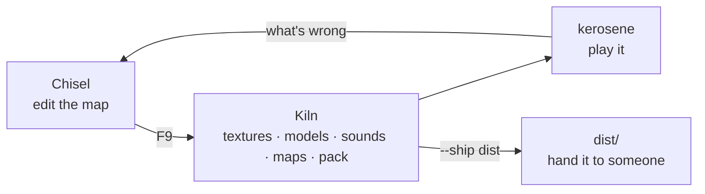

# Making a game

This section is for people who want to *build something on* Kerosene, as
opposed to people working on Kerosene itself. The rest of the book describes
the engine from the inside; these pages describe it from where a game
developer stands: what a project is, what it looks like on disk, how it gets
built, and what has to be true before you hand it to somebody.

> [!WARNING]
> Kerosene is pre-alpha. Everything described here works, but the list of
> things a finished game needs and the engine does not yet have is long — see
> [Publishing](publishing.md#you-can-but) and
> [Missing features](../docs/missing-features.md) before you commit to it.

## Two shapes of project

A Kerosene project is a directory with a `.keroproj` file at the top and a
content tree beside it. There are two kinds, and the difference is one key.

**A content-only project.** Maps, materials, models, sounds and scripts, and
nothing compiled. The game binary is the stock `kerosene` runtime, unmodified.
All of the behaviour comes from entity I/O wired in Chisel and from Rhai
scripts (see [Scripting](../docs/scripting.md)), using the entity classes
that ship in `kerosene-game`. This is a mod, in Source's sense, and it is the
cheaper of the two by a long way: no Rust, no build of the engine, nothing to
maintain when the engine moves.

**A game crate.** Your own Rust binary, depending on `kerosene-engine`, with
your own entity classes and rules. This is what you want when the stock
classes are not enough — a weapon, an inventory, an NPC — because those
cannot be scripted: Rhai is deliberately sandboxed and cannot allocate an
entity, touch the renderer or open a file. The reference for a game binary is
`apps/kerosene/src/main.rs`, which is short: parse arguments, build an
`EngineConfig`, run. `crates/kerosene-game` is the analogue of Source's game
DLL, and its own docs say the intent plainly: *nothing in this crate is
required by the engine, and a different game would replace it wholesale*. You
register your classes the way it does, through
`kerosene_game::register(&mut ClassRegistry)`, or replace it with a crate of
your own.

The key that turns one into the other is `game`.

## The project file

```text
project
{
    "name"     "My Game"
    "content"  "content"
    "startmap" "mg_intro"
    "game"     "my-game"
}
```

| Key | Means | If absent |
|---|---|---|
| `name` | What the title bar and the shipped `README.txt` call it | The file's own name |
| `content` | The content tree, relative to the project file | `content/` beside the file, then the file's directory |
| `startmap` | The map `kerosene` loads with no `+map` | Nothing loads until something says `+map` |
| `game` | The Cargo package whose binary *is* the game, built and copied by `kiln --ship` | The stock `kerosene` runtime ships instead |
| `dir` | Repeatable: the directories the content tree is made of, when the standard set is not wanted | The standard set below |

`content` is relative so the project can be cloned or moved and still be
right. Every tool and the engine find the project the same way, with the same
code, so there is one answer to "where is the content" and each program says
which answer it took. The full account is in
`crates/kerosene-vfs/src/project.rs`.

## The content tree

```text
content/
  engine.kconfig      renderer, window size, vsync — written on first run
  art/                source textures (.png) and meshes (.obj)
  textures/           texture *sets*: colour, normal, roughness… per folder
  materials/          .keromat — hand-written KeyValues
  models/             .keromdl, compiled by Forge from art/
  maps/               .keromap (yours) and .kerobsp (compiled)
  sound/              .wav / .flac / .mp3 sources and compiled .keroaud
  scripts/            .keroscript (Rhai) and the .kerosnd sound table
  <name>.vault        the archive Kiln packs everything into
```

Sources and build outputs sit side by side on purpose: every `.obj` under
`art/` becomes a `.keromdl` at the matching path under `models/`, and every
`.keromap` under `maps/` becomes a `.kerobsp`. There is no list to keep up to
date. Commit the sources; the compiled files are outputs and reproducible.

`engine.kconfig` always exists once anything has run — the first program to
look for it and not find it writes the defaults. See
[Configuration](../docs/configuration.md).

## The loop



Day to day:

```sh
cargo run --release -p kerosene-tools -- chisel content/maps/mg_intro.keromap
kerosene-tools kiln                  # or the build panel, or F9 in Chisel
kerosene                             # loads startmap
```

Chisel's `F9` compiles the current map and launches the engine on it, and
builds any textures added since the editor opened. `kiln --only maps --fast`
skips the visibility and lighting passes while a layout is still moving; an
unvised, unlit map loads and plays, it just draws everything and looks flat.

Everything Kiln does is also a subcommand you can run by hand or from a build
server — `cleave`, `umbra`, `resonance`, `radiance`, `alchemy`, `forge`,
`timbre`, `vault`
— and [Tools](../docs/tools.md) is the reference for each.

When the game is ready for other people, the last stage is
`kiln --ship <dir>`, and [Publishing](publishing.md) is about what that does
and what it cannot do for you.

## Where to read next

* [Formats](../docs/formats.md) — every file above, byte by byte.
* [Scripting](../docs/scripting.md) — the whole Rhai surface on one page.
* [Audio](../docs/audio.md) — the `.kerosnd` table and how sounds are placed.
* [Positioning](../docs/positioning.md) — what the engine is shaped to be
  good at, which is the honest way to decide whether to use it.
