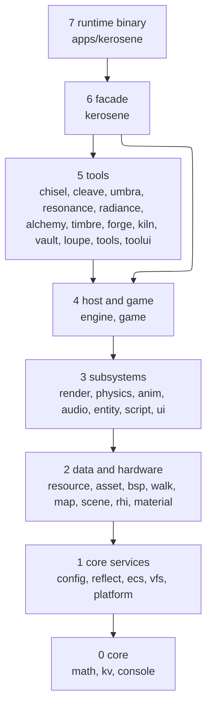

# Architecture

## Layers

A crate may depend on any lower layer. Layer 3 crates may **not** depend on
each other, with one recorded exception (`ui` → `script`, listed with its reason
in `xtask/src/layers.rs` as something to revisit). `kerosene-map` may only be
linked from layer 5 up.

The authoritative table is `xtask/src/layers.rs`; the full per-crate graph and
summaries are in the [Crate map](../devnotes/crate-map.md).

## What each layer is for

| Layer | Holds | Notes |
|---|---|---|
| 0 core | units and geometry, KeyValues text, console and logging | No engine concepts |
| 1 core services | `engine.kcfg`, reflection and ECS facades, the file system, the store seam | `kerosene-vfs` finds the content root; `kerosene-platform` hides Steam |
| 2 data and hardware | compiled formats, the scene contract, the GPU interface | `kerosene-rhi` is the only crate that opens a GPU; `kerosene-bsp` has no GPU dependency |
| 3 subsystems | one capability each | Independent of one another |
| 4 host and game | `Engine`, `Game`, `host`, stock classes | The only place subsystems meet |
| 5 tools | editor and compilers | Never linked by the runtime |
| 6 facade | `kerosene` | The only published crate |
| 7 runtime | `kerosene::launch(Stock, …)` | Nothing else |

## The four seams

Layering says what may not connect. Four seams say where connection happens.

| Seam | Where | Purpose |
|---|---|---|
| **Game** | `Game` trait, `crates/kerosene-engine/src/game.rs` | A game plugs in rules without the engine knowing it |
| **Platform** | `Engine` (no surface) vs `host` | Simulation without a window or GPU |
| **Content** | `kerosene_vfs::root` and `toolchain` | One answer to "where is the content, and which binary runs the next stage" |
| **Format** | `kerosene-asset`, `kerosene-map`, `kerosene-bsp` | Writer and reader share struct definitions, so the format *is* the agreement |

Details and diagrams: [Crate map](../devnotes/crate-map.md).

## Packaging

None of the workspace crates is published on its own. `cargo xtask bundle`
folds them into the single `kerosene` crate (`xtask/src/bundle.rs`): each
package becomes a module, internal paths are rewritten, tool crates sit behind
the `tools` feature, and the dependencies merge into one manifest. A game
therefore depends on one crate and one version.

## Third-party foundations

| Concern | Choice | Reached through |
|---|---|---|
| ECS | `bevy_ecs` (exact pin) | `kerosene-ecs` |
| Reflection | `bevy_reflect` (exact pin) | `kerosene-reflect` |
| GPU | `wgpu` 25 | `kerosene-rhi` |
| Windowing | `winit` 0.30 | `kerosene-engine::host` |
| Tool and in-game debug UI | `egui` 0.32 | `kerosene-toolui`, `host` |
| Physics (rigid) | `box3d-rust` | `kerosene-physics::rigid` |
| Scripting | `rhai` | `kerosene-script` |
| Game UI layout | `taffy` | `kerosene-ui` |
| Audio output | `cpal` | `kerosene-audio` |

Versions drift; `Cargo.toml` at the repository root is authoritative. Why these
are wrapped is in the [decision log](decisions.md).

## See also

- [Crate map](../devnotes/crate-map.md)
- [Architecture (user-facing)](../docs/architecture.md)
- [Tools and the build](../devnotes/tools-and-build.md)
