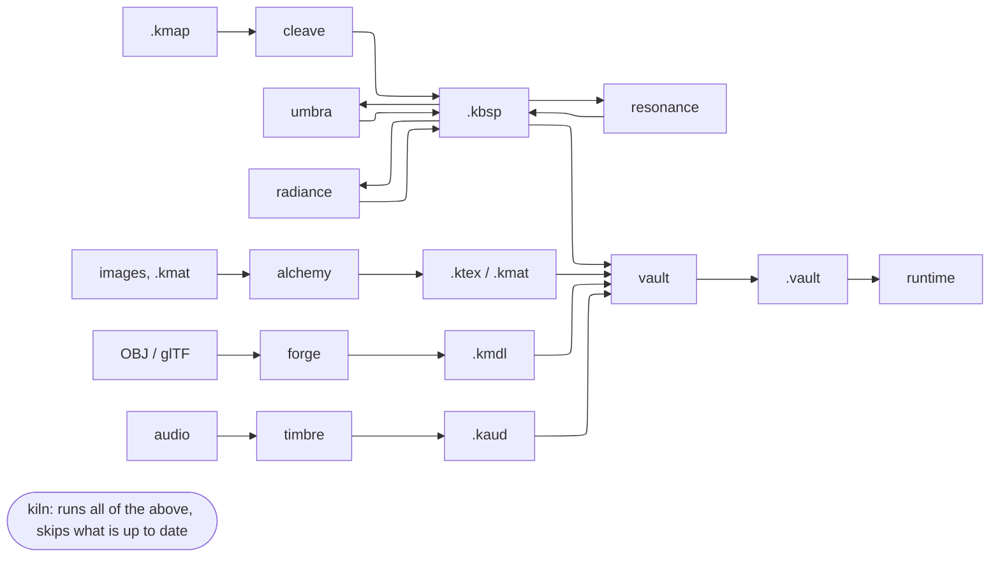

# Data and the build pipeline

## Source and compiled formats

Authors edit **source** formats; tools compile them; the runtime reads only
**compiled** formats.

| Kind | Source | Compiled | Compiled by |
|---|---|---|---|
| Map geometry | `.kmap` | `.kbsp` | `cleave` |
| Visibility | (from `.kbsp`) | `.kprt` / PVS in `.kbsp` | `umbra` |
| Lighting | (from `.kbsp`) | lightmaps in `.kbsp` | `radiance` |
| Acoustics | (from `.kbsp`) | acoustics in `.kbsp` | `resonance` |
| Navigation | (from map) | `.kwalk` | map build |
| Textures and materials | images, `.kmat`, `texture.kcfg` | `.ktex`, compiled `.kmat` | `alchemy` |
| Models | OBJ, glTF | `.kmdl` | `forge` |
| Sound | audio files, `.ksnd` | `.kaud` | `timbre` |
| Packaging | a content tree | `.vault` archive | `vault` |

Always-source, read at run time: `.kproj` (project), `.kdef` (entity classes),
`.kscr` (map script), `.kui`/`.kcss` (UI), `engine.kcfg`. Saves are `.ksav`
(JSON). The authoritative list with layouts is [Formats](../docs/formats.md).

## Pipeline

`kiln` builds a whole project and decides what is stale. Chisel and Kiln share
`kerosene_vfs::toolchain::MapStages`, so the editor's "build" and the project
build run the same stages in the same order.

## Content discovery

`kerosene_vfs::root` is the single answer to "where is the content tree". It
finds it from a marker file, or by climbing to a `.kproj`, and returns a
`Found` whose `why` explains the choice. At run time the `Vfs` is a stack of
mounted directories and `.vault` archives; archives mount after directories so
loose files override packed ones, which is what makes modding and iteration
work.

## Compiled resource container

`kerosene-resource` defines the compiled container: a header, typed blocks, a
dependency list and the hash of the source. A `Resource<T>` handle is cheap to
copy and resolves through a cache. The dependency list and source hash are what
let `kiln` and hot reload (`crates/kerosene-engine/src/hotload.rs`) tell what
needs rebuilding or reloading.

## Rules for adding a format

1. Put the reader **and** writer in a crate at layer 2 so both sides compile
   from the same structs.
2. Give it a short `k…` extension and add it to [Formats](../docs/formats.md).
3. Compile at build time; the runtime must not need the source format.
4. Version it in the header. In alpha there is no migration obligation; see the
   [decision log](decisions.md).

## See also

- [The map pipeline](../devnotes/map-pipeline.md)
- [BSP internals and traces](../devnotes/bsp-and-traces.md)
- [Formats](../docs/formats.md)
- [Tools and the build](../devnotes/tools-and-build.md)
