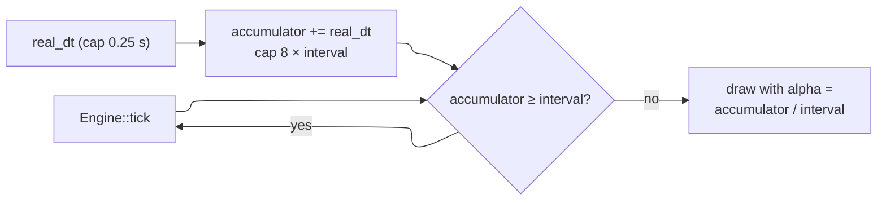

# Runtime

## Two layers, one boundary

- **`Engine`** (`crates/kerosene-engine/src/engine.rs`) is the entire
  simulation. It has no window, no GPU and no input device.
- **`host`** (`crates/kerosene-engine/src/host.rs`) owns the winit event loop,
  the wgpu surface and egui, and calls `Engine::frame` once per redraw.

*Why:* an engine that cannot start without a GPU cannot host a server or run
in CI. The boundary is enforced structurally: `Engine` has no surface field.
`--headless N` runs `Engine` alone for N ticks.

## Start-up

`kerosene::launch(game, LaunchOptions)` (`crates/kerosene-engine/src/launch.rs`):

1. installs the logger and crash handler;
2. parses arguments (`--content`, `--vault`, `--headless`, `+map`, `+cvar`);
3. finds the content root, project (`.kproj`) and `engine.kcfg`;
4. runs headless, or enters `host::run_with`.

`Engine::with_game` then asks the game for its classes, calls `setup` (after the
console exists, before `config.cfg`/`autoexec.cfg`/command line run, so a game's
convars can be set from any of them), and executes the startup commands.

If no map is named, the engine loads the built-in fallback map `kerosene_room`
(`FALLBACK_MAP` in `crates/kerosene-engine/src/base.rs`), compiled into the
binary with a small base content set.

## Fixed tick, variable frame

Simulation runs at `sv_tickrate` (default 64 Hz). Rendering runs as fast as it
can and interpolates between the last two states. The accumulator cap stops a
breakpoint or window drag causing a burst of catch-up ticks. The host takes the
latest input for view angles and blends only positions, so the camera responds
at frame rate.

## One tick

Order matters; it is documented step by step in
[Runtime and the tick](../devnotes/runtime-tick.md). In outline:

1. `game.pre_tick`: change movement parameters before they are read
2. player movement (`kerosene_physics::player_move`), footsteps, listener
3. triggers, then `entities.run` (events, thinks, removals)
4. engine and game answer entity requests
5. `game.tick`: game rules, after I/O and before props step
6. rigid-body step, streaming update, map script `on_tick`

## The `Game` trait

Defined in `crates/kerosene-engine/src/game.rs`; every hook has a default, so a
game implements only what it needs.

| Group | Hooks |
|---|---|
| Registration | `classes`, `schema`, `setup` |
| Map lifecycle | `map_loaded`, `map_unloading` |
| Per tick | `pre_tick`, `tick` |
| Host requests | `entity_request`, `console_request` |
| UI | `wants_ui`, `ui`, `ui_event` |
| Saves | `save`, `load`, `can_save` |
| Events | `platform_event`, `player_damaged`, `player_died`, `player_spawned`, `frame`, `shutdown` |

**Design constraint:** the engine takes the game out of itself while a hook
runs (`Engine::with_game_mut`), so a hook cannot trigger another hook on the
same game. A game changes map with `Engine::request_map`, not `load_map`; a
nested call is logged and skipped rather than deadlocking.

## Requests

Handlers on entity classes get only `&mut EntityWorld`, and console commands
only the console. When they need the rest of the engine they leave a request.
The engine claims the verbs it knows (`script`, `play_sound`, `phys_wake`, …),
the game gets the rest, and anything unclaimed is reported. This keeps
`kerosene-entity` and `kerosene-console` plain data structures.

## See also

- [Runtime and the tick](../devnotes/runtime-tick.md)
- [The console](../docs/console.md)
- [Making a game](../gamedev/making-a-game.md)
